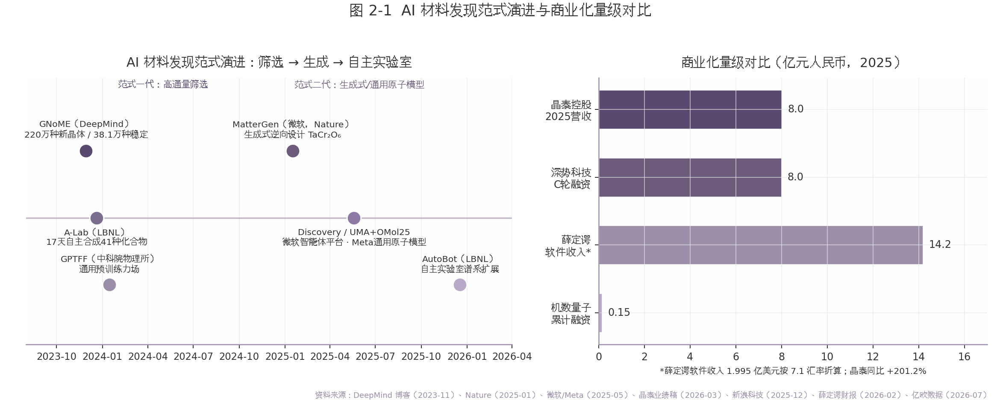
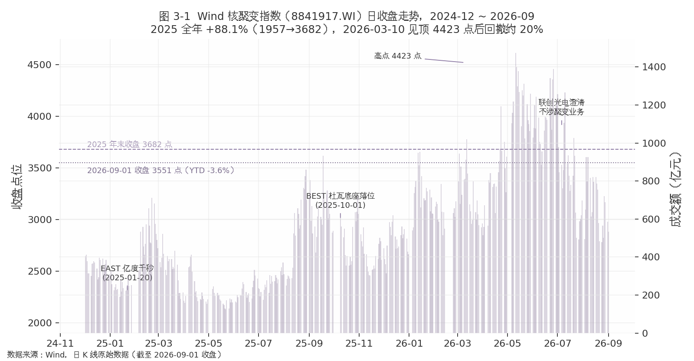
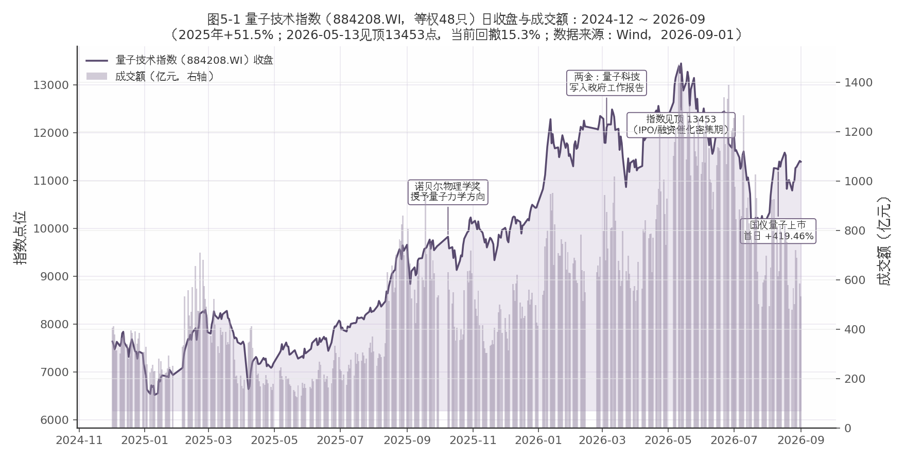
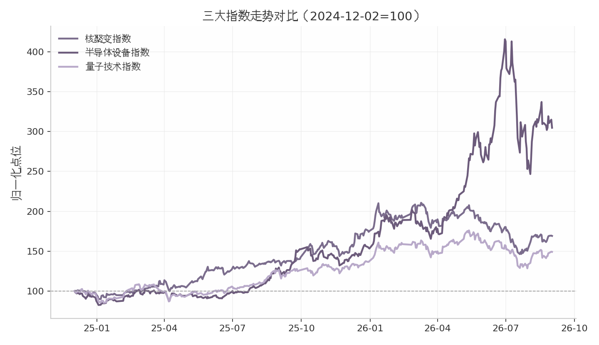
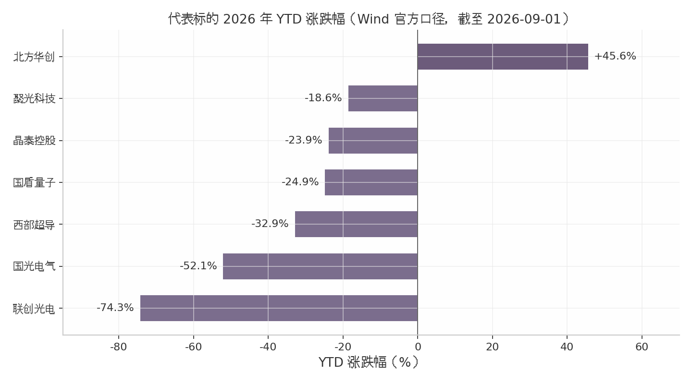

# AI×物理工程化应用板块图谱研报

**报告日期：2026-09-01**｜数据基准：2026-09-01（各数据截止日期以文内标注为准）

> 范围：凝聚态物理、等离子体物理、粒子物理、冷原子物理、理论/计算物理 × AI 的工程化应用相关板块。
>
> 本报告为研究分析，不构成投资建议。

## 第一章 总览：框架、五域梯度与政策母题

### 1.1 范围界定：凝聚态/等离子体/粒子/冷原子/理论计算物理×AI 的工程化应用

最关键的界定性发现：2024–2026 年 AI 在物理各分支中已从"参数优化工具"升级为"决定性使能技术"。标志事件可量化：中科大团队以 AI 在 60 毫秒内完成 2024 个原子的无缺陷阵列重排（中国科大官网，2025-12-15）；DeepMind 开源模拟器 TORAX 已深度嵌入 CFS SPARC 研发流程（福建省科技厅转引，2026-02-12）。

据此，本报告界定五域：凝聚态物理（AI 材料计算）、等离子体物理（可控核聚变）、粒子物理（加速器/探测器技术外溢）、冷原子物理（量子计算与精密测量）、理论/计算物理（AI4Science 平台）。纳入口径为工程化判据——收入、订单、装备部署或仪器销售，而非论文产出；半导体设备作为凝聚态工程化最成熟的 A 股兑现载体，纳入梯度对照但不单列。

### 1.2 五域工程化成熟度梯度（半导体设备>量子精密测量>核聚变>AI 材料计算>粒子物理外溢）

核心发现：五域成熟度梯度清晰，且二级分化与一级火热明显错位。

| 域 | 成熟度判据 | 行情与估值（Wind，2026-09-01） | 标志事件 |
|---|---|---|---|
| 半导体设备 | 业绩兑现 | 指数 2025 年 +81.3%（首交易日基期，Wind 自算）、2026 YTD +98.6%；PE 113.9 倍 | 北方华创订单排至 2027Q1（界面新闻，2026-01-07） |
| 量子精密测量 | 上市+扭亏在望 | 量子技术指数 2025 年 +51.5%（首交易日基期，Wind 自算）、YTD +8.4%，PE 23 倍 | 国仪量子 2026-08-11 上市，实募约 8.49 亿元（原拟 11.69 亿元）、首日 +419.46%（新浪，2026-08-12；招股书/界面，2026-05~08） |
| 核聚变 | 订单周期启动 | 指数 2025 年 +88.1%（首交易日基期，Wind 自算；另一口径 +101%，长沙晚报，2026-01-05）、YTD -3.6% | 2026 年招标约 250 亿元、约为 2025 年 5 倍（国盛证券，2026-02-09） |
| AI 材料计算 | 商业化验证中 | 无板块指数；晶泰控股 YTD -23.9% | 晶泰 2025 年营收 8.03 亿元（+201.2%）首盈（美通社，2026-03-25）、2026H1 预亏 2.15–2.75 亿元（雪球转述，2026-08，公告原文待核） |
| 粒子物理外溢 | 标的稀疏 | 无独立板块，映射至科学仪器/加速器硬件链 | 辐照加速器市场 2024 年 244.79 亿元（智研咨询，2025-04-09） |

解读：梯度本质是收入可见度差异。半导体设备有同比约 80% 的订单增速支撑；量子精密测量已有 6.66 亿元年营收、三年复合增速 29.1%（招股书/36氪，2026-05 至 08）；核聚变收入依赖招标节奏，指数自 2026-03-10 高点回撤约 19.7%；粒子物理侧北方夜视、迈胜医疗等关键产业化主体均未上市，映射最弱。错位同样值得记录：量子赛道 2026 年上半年一级融资超百亿元，远超 2025 年全年约 25 亿元（凤凰网，2026-08-04）。

### 1.3 政策母题：十五五未来产业、2026 政府工作报告、国发〔2025〕11 号「AI+科学技术」

核心判断：五域共享同一政策母题——"未来产业+AI 赋能基础研究"双轨定调。"十五五"规划建议将量子科技列为六大未来产业之首、核聚变能并列（新华社，2025-10-24）；2026 年政府工作报告（2026-03-05）提出"建立未来产业投入增长和风险分担机制"；国发〔2025〕11 号将"人工智能+科学技术"列为六大重点行动之首（人民日报，2025-08-27）；2026 年 6 月证监会将量子科技纳入科创板重点支持领域（36氪，2026-08-11）。

对冲提示：政策密度虽处历史高位，定调向订单与利润的传导仍有时滞；各板块商业化时间表普遍早于 ITER DT 运行 2039、CFEDR 预计 2035 年建成的官方路线（ITER 官网，2024-07-03），执行风险不宜低估；估值端半导体设备 PE 113.9 倍、国盾量子 PE 6483 倍（Wind，2026-09-01）已明显透支。政策β 能否兑现为业绩α，是后续章节检验的主线。

## 第二章 凝聚态×AI：材料发现与材料计算

凝聚态物理与 AI 的交叉正在经历从"筛选存量"到"生成增量"再到"闭环自主实验"的范式跃迁。本章核心判断：技术侧已完成三代范式迭代，但商业化仍处验证期——全球范围内仅晶泰控股一家 AI4S 公司实现年度盈利（2025 年净利 1.346 亿元，美通社业绩稿，2026-03-25），A 股则缺乏纯正标的与官方指数，题材炒作成分显著。

### 2.1 技术范式演进：GNoME→MatterGen/UMA→自主实验室

最重要的发现是：AI 材料发现的主战场已从"高通量虚拟筛选"切换为"生成式逆向设计"，且自主实验室正在打通"预测—合成—表征"的最后一公里。

第一代范式以高通量筛选为标志。Google DeepMind 于 2023 年 11 月发布 GNoME，宣称发现 220 万种新晶体结构、其中约 38.1 万种热力学稳定（DeepMind 官方博客，2023-11-29）；外部团队已独立合成其预测的 736 种材料（Nano-Micro Letters 综述，2026-01-10）。需要指出的是，截至 2026 年 9 月未检索到 DeepMind 发布 GNoME 的直接换代模型，该巨头近两年重心偏向蛋白质与游戏智能体，材料侧呈"成果吃老本"状态。

第二代范式由微软与 Meta 主导。微软 MatterGen 于 2025 年 1 月登上 Nature，以扩散模型按目标性能直接生成无机材料，"稳定+独特+新颖"结构比例较此前生成模型提高 2 倍以上、距 DFT 局部能量最小值的精度提高约 10 倍（Nature 论文 s41586-025-08628-5，2025-01-16），并与中科院深圳先进院合作合成 TaCr₂O₆，实测体积模量 169 GPa 对目标 200 GPa，误差小于 20%（微软研究院，2025-01-21）。Meta FAIR 同期发布超 1 亿条量子化学计算的 OMol25 数据集（耗费超 60 亿 CPU 小时）与跨数据集训练的 UMA 通用原子模型（Rowan 博客，2025-05-23），原子级基础模型时代开启。国内中科院物理所的 MatChat 材料合成大模型基于 3.5 万余条无机固相合成路径微调（科学网，2025-02-17），2024 年初升级为通用预训练力场 GPTFF。

第三代范式是自主实验室闭环。伯克利国家实验室 A-Lab 利用 GNoME 与 Materials Project 数据，17 天连续运行合成 41 种新无机化合物（58 个目标中 41 成功）（Nature 论文 s41586-023-06734-w，2023-11）；单化合物 10–20 小时即可完成混料、烧结、表征全流程（Ceder AI4AM2025 摘要，2025）。LBNL 于 2025 年建成 AutoBot 平台，用机器学习引导机器人合成表征光电候选材料（Berkeley Lab 年终盘点，2025-12-17）。行业综述称 AI 驱动方法可将材料从概念到商业化的 10–20 年传统周期压缩至 1–2 年（Cypris 综述引 He et al.，2025-12-05，C 级信源，谨慎采用）——这一压缩倍数若属实，将重构材料产业的研发成本曲线，但其样本代表性存疑。

### 2.2 商业化现状：晶泰控股、深势科技、机数量子

最重要的发现是：商业化呈"一盈、一融、一早期"的清晰梯队，且盈利持续性存疑——唯一盈利的晶泰已预告 2026 年上半年由盈转亏（雪球资讯转述，2026-08，公告原文待核）。

| 公司 | 阶段 | 关键量化指标 | 材料侧落点 |
|---|---|---|---|
| 晶泰控股（2228.HK） | 港股上市，2025 首盈 | 营收 8.026 亿元（+201.2%）、净利 1.346 亿元、期末现金 70.69 亿元（美通社业绩稿，2026-03-25） | 与晶科能源共研钙钛矿叠层电池；向巴斯夫交付配方测试智能工作站（同上） |
| 深势科技 | C 轮，未上市 | 超 8 亿元 C 轮（新浪科技，2025-12-24）；服务超 150 家先进研发企业，客户含宁德时代、比亚迪、中国钢研（公司通稿，2025-12-24） | DeePMD/DPA-2 原子大模型；Uni-ELF 电解液模型宣称精度 95%（arXiv:2407.06152） |
| 机数量子 | A+ 轮，成立约 1 年 | 累计融资约 1500 万元（亿欧数据，2026-07-25） | 材料大数据+量子化学计算，主攻"卡脖子"高端材料 |
| 对照：薛定谔（SDGR） | 美股上市 | 软件收入 1.995 亿美元（+10.6%）、毛利率 74%、仍净亏 1.033 亿美元（公司财报，2026-02-25） | 材料科学收入 1700 万美元（GuruFocus，2026-02-26） |

表 2-1 解读：三家国内公司恰好构成 AI 材料计算商业化的三级切片。晶泰证明了"机器人实验室+AI 服务"模式可以在单一年度跑通盈利——但其 8 亿元营收中药物发现占 5.38 亿元（+418.9%）（美通社业绩稿，2026-03-25），材料业务实为副业；深势走"模型授权+平台订阅"路线，客户名单豪华却未披露任何营收数据，C 轮估值缺乏公开锚；机数量子 1500 万元的融资体量说明早期资本仍在小额试水。横向看，深耕三十年的薛定谔软件毛利率高达 74% 却尚未盈利，提示该赛道"高毛利不等于高净利"，研发与销售费用是长期吞金兽。晶泰公告预计 2026 年上半年净亏损 2.15–2.75 亿元、由盈转亏（雪球资讯转述，2026-08，公告原文待核），进一步印证盈利的脆弱性。

### 2.3 A 股映射与题材风险（志特新材案例）

最重要的发现是：A 股缺少"纯 AI4S"标的，也无官方概念指数，板块行情由个别题材股的情绪外溢驱动，证伪风险高。

纯正标的集中于港股 18A/18C（晶泰、英矽智能、剂泰等），A 股只能以 CAE/工业软件与算力间接映射。2026 年初的板块热点由志特新材（300986.SZ）扛起：2026-01-10 上午再度 20CM 涨停、六连板，2026 年以来累计涨幅超 198%（同花顺财经，2026-01-10）。其 AI4S 叙事包括与量子科技长三角创新中心、中科大孵化的微观纪元共建"量子计算+AI"材料研发平台，子公司部署 12 条 AI 机器人产线，自有管线为 MOF 材料与防晒隔热玻璃（东方财富财富号，2026-08-07）。然而同一信源同时提示概念"降温"信号；公司 AI4S 业务占比目标仅是从 8% 提至 35%（微信公众号深度分析，2025-08-07）——即当前收入的 92% 与 AI 材料无关，六连板涨幅与基本面兑现之间存在量级错配。

必须显式声明的缺口：截至 2026 年 9 月，未检索到同花顺或 Wind 官方"AI4S 概念指数"的成分股清单与板块区间涨跌幅，本节的板块判断基于龙头个股表现与媒体叙事，系统性偏差不可避免。参照兄弟板块经验（核聚变题材 2025 年炒作、2026 年部分标的证伪出清），AI4S 题材股若缺乏订单与收入跟进，大概率重演"情绪外溢—均值回归"路径；投资者宜以"AI 业务收入占比"作为第一道筛选闸门，对仅有合作协议与产线规划、无收入披露的标的保持对冲性仓位。

*本章数据截至 2026-09-01；涉及"待核"标注的数字未经一手公告复核，引用时请注意口径。*

## 第三章 等离子体×AI：可控核聚变板块

AI 与等离子体物理的交叉已从单点实验验证转入工程化部署阶段：强化学习控制器已在 DIII-D、EAST、HL-3 等真实装置上直接指挥线圈与加热功率（自动化学报综述，2026-08-01），开源可微模拟器 TORAX 深度嵌入 CFS 的 SPARC 研发流程（福建省科技厅，2026-02-12），而资本市场对此的定价经历了 2025 年指数翻倍的超级主线与 2026 年自高点回撤近 20% 的消化期（Wind，截至 2026-09-01）。

### 3.1 AI 等离子体控制工程化（RL 控制谱系、TORAX、DeepMind×CFS）

强化学习磁控的谱系始于 2022 年 DeepMind 与 EPFL 在 TCV 装置上实现的首个深度强化学习端到端控制：单一策略统一输出全部线圈电压，覆盖 ITER 相似、负三角、雪花偏滤器等位形（Nature 2022；自动化学报综述，2026-08-01）。此后的工程化演进沿三条线索展开。其一，摆脱平衡重构依赖：2025 年 6 月 DIII-D 团队首次以 SAC 算法实现原始磁测信号到执行器指令的直接映射（微信公众号行业综述，2025-08-25；自动化学报综述，2026-08-01）；2026 年 5 月公开的后续工作进一步实现零样本动态形状跟踪，静态构型平均形状误差 2.01 厘米，随机屏蔽 30% 磁传感器仍保持鲁棒，且策略已迁移至 DIII-D 真实放电完成两次动态形状机动（arXiv:2605.15935，2026-05-15）。其二，主动规避不稳定性：DIII-D 上 RL 策略可提前 25 毫秒预测撕裂模概率并调节中性束功率与上三角变，实现"边界巡航"式高性能运行（自动化学报综述，2026-08-01）。其三，国产装置跟进：EAST 部署基于 PPO 的 βp 实时闭环控制，HL-3 建成数据驱动智能控制系统、实现电流与位形宏观参数闭环，成果发表于 Nature Communications Physics 与 Nuclear Fusion（自动化学报综述，2026-08-01；观察者网心智观察所，2026-05-24）。该综述同时指出，部分可观测性、安全约束内生与仿真-现实差距仍是核心瓶颈（自动化学报综述，2026-08-01）。

产业侧标志性事件是 2025 年 10 月 16 日 Google DeepMind 与 CFS 的合作：以 JAX 编写的可微分开源输运模拟器 TORAX 支撑数百万次虚拟实验优化 SPARC 运行方案，并叠加强化学习堆运行优化与实时控制三条轴线；TORAX 已深度集成于 CFS 日常研发流程（谷歌官方博客，2025-10-16；福建省科技厅，2026-02-12）。这意味着 AI 控制不再是学术演示，而已成为私营聚变装置的研发基础设施。

### 3.2 装置与资本：国家队平台与民营融资潮

2025—2026 年中国聚变装置节点高度密集，构成板块行情的基本面锚：

| 装置 | 关键节点 | 时间表 | 来源 |
|---|---|---|---|
| EAST | 1 亿℃×1066 秒稳态高约束模（2025-01-20），入选 2025 年度"中国科学十大进展"；密度达 Greenwald 极限 1.6 倍 | 下一步冲击 1.5 亿℃ | 安徽日报（2026-03-31）；新浪（2026-08-14） |
| HL-3 | "双亿度"（2025-03），等离子体电流 1.15MA 创中国纪录（2025-10） | 2027 年首次氘氚燃烧实验 | 新浪（2026-08-14） |
| BEST | 2025-05 提前总装、2026-06 主环吊装过半；主机 6000 吨、体积比 ITER 小 40% | 2027 年底建成放电，力争 2030 年演示发电 | 东方财富（2026-01-18）；新浪（2026-08-14） |
| 洪荒 70 | 全球首台全高温超导托卡马克，长脉冲升至 1337 秒（2026-02-02），国产化率超 96% | 2027 年建洪荒 170（Q>10） | 上证报（2026-02-06） |
| 星火一号 | 聚变-裂变混合堆，设计接近尾声；总投资超 200 亿元 | 一期 2029 年底建成、2030 演示发电 | cinie.net（2026-05-06）；中泰证券（2025-11-18） |

五台装置共同指向 2027—2032 年的密集兑现窗口，时间表均显著早于 ITER 的 2039 年氘氚运行新基线（ITER 官网，2024-07-03）与 CFEDR 的 2035 年建成预期（与非网，2026-06-23）。需要注意，民营与国家队时间表普遍压缩了从能量增益验证到工程示范的间隔，执行风险不容低估；BEST 的 2030 年"第一度电"目标与洪荒 170 的 Q>10 目标均尚无第三方验证路径披露，时间表宜作情景假设而非基准预期。资本侧的锚更实：国家队平台中国聚变能源有限公司 2025 年 7 月 22 日在上海挂牌，注册资本 150 亿元（财新，2025-07-23）；BEST 主体聚变新能注册资本增至 145 亿元（行业深度报告，2026-03-20）。民营端 2026 年上半年国内聚变赛道融资总额超 70 亿元（新浪，2026-08-14）：星环聚能 2026 年 1 月完成 10 亿元 A 轮刷新国内民营聚变单笔纪录、5 月再获 5 亿元 A+ 轮后估值破 10 亿美元（人民网上海，2026-01-12；星环聚能官网，2026-05-27），且募资明确投向 AI 等离子体控制的工程转化；诺瓦聚变一年内完成 5 亿元天使轮与 7 亿元天使+轮（虎嗅，2026-04-01；36氪，2026-07-07）。海外 CFS 累计融资 40 亿美元、约占全球私营聚变融资 30%（TechCrunch 转引，2026-07-31），Helion 估值达 155 亿美元（GeekWire，2026-06-04）。

### 3.3 A 股板块：2025 超级主线→2026 消化期

可控核聚变是 2025 年 A 股确定性最高的题材主线之一，但两个口径需并列呈现：Wind 核聚变指数（8841917.WI）2025 年全年上涨 88.1%（1957→3682 点，以 2025 年首个交易日收盘为基期；若按 2024 年末收盘基期则为 +83.2%，Wind 日 K 自算，截至 2026-09-01），另一媒体口径全年涨约 101%（1069.73→2155.34 点，长沙晚报，2026-01-05），两者因指数编制与基期不同而并存；同花顺口径约 +85% 的用户复盘数据（雪球，2026-01-25，用户自制）与 Wind 口径基本吻合。龙头中洲特材、合锻智能全年涨幅超 200%（财联社，2025-12-31），联创光电亦涨约 120%（雪球，2026-01-25）。

2026 年转入消化期，节奏可量化为三段：1 月受《原子能法》施行（2026-01-15）、星环聚能 10 亿元融资与 BEST 节点催化，指数月内走强（月收盘涨幅约 8.5%、月中盘中高点较 2025 年末一度约 +20%，Wind 日 K 自算，2026-09-01；另有雪球复盘帖称单月 +22%，2026-01-25，与 Wind 口径有差异），单日成交峰值 870 亿元（2026-01-12）；3 月 10 日见顶 4423 点后持续回撤，截至 2026 年 9 月 1 日收盘 3551.20 点，自高点回撤 19.7%，Wind 官方口径 YTD 为 -3.55%，指数 PE(TTM) 回落至 29.75 倍、PB 1.64 倍（Wind，截至 2026-09-01）。值得警惕的量价结构是"放量滞涨"：2026 年日均成交 360 亿元较 2025 年的 205 亿元放大 76%，但指数不涨反跌，叠加近 60 日主力资金净流入 271.4 亿元（Wind，截至 2026-09-01），显示筹码在高位完成交换、机构与散户持仓结构正在重构。订单端则是消化期的对冲变量：机构测算 2026 年行业招标规模约 250 亿元、为 2025 年约 50 亿元的 5 倍（国盛证券，2026-02-09），国内主要聚变项目总投入约 1465 亿元、其中高温超导磁体市场近 300 亿元（长沙晚报，2026-01-05）。

标的链按环节可拆为：超导磁体（西部超导、永鼎股份、精达股份）、真空室与锻件（合锻智能为 BEST 真空室核心供应商）、偏滤器与第一壁（安泰科技、国光电气）、电源系统（许继电气支撑环流三号、英杰电气）、低温系统（杭氧股份）（中泰证券，2025-11-18；国盛证券，2026-02-09；腾讯，2025-10-13）。消化期的分化已经显现：西部超导 2026 年 YTD -32.88%、国光电气 -52.12%（Wind，截至 2026-09-01）。

联创光电是本轮题材出清的标志性案例。该公司 2025 年作为聚变题材龙头上涨约 120%（雪球，2026-01-25），2026 年 1 月 12 日创 78.76 元历史高点，但 7 月 1 日澄清"主营业务不涉及高温超导、可控核聚变"（其参股 40% 的联创超导 2025 年亏损 2464.53 万元）；8 月 4 日"六雷齐发"——证监会立案、实控人辞任总裁、5.06 亿元债务逾期、3.96 亿元账户冻结、25 起诉讼、控股股东股权遭司法拍卖，8 月 28 日再曝 16.92 亿元预付款流向控股股东构成资金占用（腾讯新闻，2026-08-11；凤凰网，2026-08-29；华夏时报，2026-08-14）。截至 2026 年 9 月 1 日其股价 16.21 元、YTD -74.29%、市值缩水至 73.1 亿元（Wind，截至 2026-09-01）。该案例提示：在 2026 年招标放量 5 倍的基本面改善与题材股治理失效并存的格局下，板块定价逻辑正从"概念映射"切换至"订单兑现"，但订单交付周期长、业绩确认滞后的结构决定了消化期大概率延续，反弹高度取决于 BEST 下半年招标与 CFEDR 启动节奏的实际落地（中泰证券，2025-11-18）。

## 第四章 粒子物理×AI：大科学装置与产业外溢

粒子物理是 AI 工程化约束最严苛、验证最充分的科学场景：CMS 已在 40 MHz 碰撞率、纳秒级延迟的 L1 硬件触发上运行无监督异常检测模型（CERN repository / ACAT 报告，2025-09-17），AI 由此从离线辅助工具升级为嵌入大科学装置实时数据链路的基础设施。但先行判断是：这一轮红利主体是 CERN、中科院高能所等科研机构，A 股仅能映射到硬件供应链，标的稀疏（见 4.3），不得按"AI 概念"高估。

### 4.1 LHC/CERN 的 AI 工程化

触发系统是工程化的制高点。CMS 在 Run 3 的 L1 Global Trigger 中部署了两套无监督异常检测：自编码器 AXOL1TL 与卷积自编码器蒸馏而来的紧凑监督模型 CICADA，已用 2024 年以来的真实对撞数据在线运行（CERN repository / ACAT 报告，2025-09-17）。面向 HL-LHC，CMS 正研发 FPGA 上的 GraphSAGE 图神经网络 μ 子径迹 finder，约束为 63 Tb/s 输入、12.5 μs 固定延迟（arXiv:2509.23347，2025-09-27）；ATLAS 同步推进 GNN-on-FPGA 在线径迹重建（CDS 2938898，2025-07-24）。离线侧，CMS 引入 GPU 异构计算使像素径迹处理时间下降 80%、HLT 单事件重建总时间下降约 40%（HAL 博士论文 tel-05534878，2025）。喷注标记方面，ATLAS 的 transformer 标记器 GN2 已正式发表：70% b-jet 效率工作点下，c-jet 排除率较上一代 DL1d 提升 3.5 倍、轻喷注提升 1.8 倍（Nature Communications，©2025）；GN2 于 2024 年集成进 ATLAS HLT，较 GN1 背景排除提升约 1.5 倍，Run 3 fast b-tagging 预筛选使后续算法输入率降低 5–10 倍（ATL-DAQ-PROC-2025-013）。组织层面，CERN 于 2025 年 4 月成立 AI 指导委员会，2025 年 11 月理事会批准全组织级 AI 战略，确立加速科学发现、运行可靠性、人才培养、与产业界共建算力四大目标（home.cern，2025-11-13）；产业抓手为 openlab 与 Siemens 在 AI 控制系统异常检测上的合作（openlab.cern，检索于 2026-09-01）。驱动力是数据规模：HL-LHC 时代 ATLAS/CMS 需实时处理约相当于 2025 年全球互联网流量四分之一的探测器数据（home.cern，2026-05-07）。

### 4.2 国内装置：JUNO、HEPS、CEPC

JUNO（江门中微子实验）是国内近期最硬的成绩单：2025-08-26 完成液闪灌注取数，2025-11-19 发布首个物理成果，基于 59 天有效数据将太阳中微子振荡参数测量精度较国际最好水平提高 1.5–1.8 倍（新华网/中科院高能所，2025-11-19）；2026-06-10 以封面文章刊于《Nature》，sin²θ12 不确定度由 4.6% 压缩至 2.81%（高能所，2026-06-11）。AI 侧，高能所已将 Agentic AI 用于 JUNO 数据生成与智能工作流（高能所实训报告，2026-05-27），但带量化指标的工程级披露仍缺位。HEPS（高能同步辐射光源）已从建成走向产业赋能：2025-10-29 通过工艺验收、2025-12-03 试运行（heps.ihep.ac.cn，2026-07-11），截至 2026 年 2 月中旬完成 91 个单位 222 项课题、近 5000 小时机时，用户含比亚迪、宁德时代（经济日报/ncsti，2026-03-24/31）；设计阶段曾用神经网络代理模型加遗传算法将托歇克寿命提高约 10%（《人工智能赋能粒子物理与核物理学》，2026-07-07）。CEPC 于 2025-10-17 发布《基准探测器技术设计报告》，采用 55 纳米读出芯片等自主技术，两大核心技术设计全部完成（高能所 CEPC 进展页，2025-12-09）。必须声明：截至 2026-09-01 未检到 CEPC 获国家正式立项批复的公开信息，EDR 完成不等于立项，开工时点（争取约 2027 年，arXiv:2505.04663，2025）存在实质性不确定性。

### 4.3 产业外溢与 A 股映射

外溢最实的方向是加速器产业化：中国辐照加速器市场由 2018 年 120.54 亿元增至 2024 年 244.79 亿元，CAGR 12.5%（智研咨询，2025-04-09）；医疗端国内质子放疗装备已运营/在建/拟建 49 家，单室系统中标价约 2.2–2.5 亿元（中国食品药品网，2025-03-25；行业洞察，2026-06-30）。

| 标的 | 关联逻辑 | 关键事实（来源，日期） |
|---|---|---|
| 中广核技（000881） | 电子加速器+辐照+质子治疗 | 截至 2024 年底在运加速器 62 台（国投证券，2025-07-15）；加速器海外收入占比 51.7%、毛利率约 40%（投资者关系，2026-04-29）；2026H1 预亏 1.0–1.3 亿元（募集说明书，2026-08-27） |
| 国光电气（688776） | 大科学装置真空/核工业部件 | ITER 偏滤器与热氦检漏设备全球首台套供应商；2025Q3 营收 2289 万元、归母净利 -2775 万元（投资者关系记录，2025-12-08；同花顺，2026-01-21） |
| 联影医疗（688271） | PET 探测器（粒子探测医疗转化） | 核心部件自研率超 90%（雪球分析帖，2025-09-14，权威度 B，需以公告核验） |
| 西部超导（688122） | 超导材料（加速器/聚变磁体） | ITER/重离子治疗装备配套（中国食品药品网，2025-03-25） |
| 中金辐照（300962）、聚光科技（300203）、皖仪科技（688600） | 辐照服务/科学仪器国产替代 | 皖仪液相色谱三重四极质谱入围工信部 2025 首台套（公司公告，2026-07-18） |

解读：上表必须按"弱映射"阅读。第一，表中公司收入主体均非"AI×粒子物理"——中广核技是加速器制造与辐照加工，国光电气 2025Q3 尚亏损，AI 收入占比无法从公开信息拆分，凡未注明处不构成"AI 概念"实证。第二，最关键的产业化主体均在 A 股之外：JUNO 大 PMT 国产主供方北方夜视为兵器工业集团下属非上市公司，迈胜医疗、艾普强、国科离子/兰州泰基等质子重离子装备商亦未上市（高能所，2025-11-21；中国食品药品网，2025-03-25）。第三，联影一条为权威度 B 来源，需以公告核验。结论：该板块的投资含义是"大科学装置硬件链订单景气"，而非"AI 算法变现"，映射应据此从严。

## 第五章 冷原子/量子×AI

本章最重要发现：2025–2026 年，AI 已从量子实验的参数优化工具升级为决定性使能技术——60 毫秒构建 2024 原子无缺陷阵列（中国科大官网，2025-12-15）与纠错"越阈值"突破（人民日报，2026-01-30）均有 AI 深度参与；但商业化兑现节奏出现明显错位，量子精密测量先于量子计算"摸到钱"（国仪量子上市首日 +419.46%，新浪，2026-08-12），而二级市场呈"一级火热、二级退潮"格局（量子技术指数 2026 YTD 仅 +8.42%，Wind，2026-09-01）。

### 5.1 技术跃迁：AI 阵列重排、量子纠错越阈值、Ising/OpenEvolve

AI 对冷原子/量子体系的渗透在 2025–2026 年出现四个标志性场景。其一，阵列重排：2025 年 8 月，中科大潘建伟、陆朝阳团队与上海人工智能实验室合作，利用 AI 实现与阵列规模无关的常数时间消耗，在 60 毫秒内构建多达 2024 个原子的无缺陷二维/三维原子阵列，创中性原子体系世界纪录；系统单比特门保真度 99.97%、双比特门 99.5%、探测 99.92%（中国科大官网，2025-12-15），并入选美国物理学会 2025 年国际物理学九大进展（人民网上海频道，2026-08-06）。其二，量子纠错越阈值：海外哈佛/Lukin 体系展示 448 个中性原子量子比特容错系统，错误率压至关键阈值以下（中国科学院，2025-11-18）；2025 年 12 月潘建伟团队基于 107 比特"祖冲之 3.2 号"实现超导路线纠错越阈值（人民日报，2026-01-30），至此全球已有谷歌、中科大、Quantinuum、量子时代公司 4 个团队跨越纠错阈值（科学网，2026-02-12）。其三，AI 直接参与纠错码设计：IBM 开源框架 OpenEvolve（大语言模型+进化算法）在双变量自行车码家族中发现 465 种新码型，含 [[288,50,8]] 码（上海科技情报所，2026-06-29）。其四，大厂入场提供基础设施：英伟达 2026 年 4 月推出全球首个开源量子 AI 模型家族 Ising，将量子比特校准周期从数天压缩至数小时，纠错速度与精度数倍跃升（QQ 新闻，2026-04-23）。综合判断，AI 在量子领域的角色正从"降本工具"转向"性能边界定义者"，但各场景距容错量子计算的工程闭环仍有数量级差距，时间表存在后移风险。

### 5.2 商业化：量子计算融资爆发，量子精密测量最先变现

国内量子计算赛道 2025 年全年融资 40 起、24.73 亿元（36氪，2026-03-17）；2026 年 Q1 单季融资即达 33 亿元，超过 2025 全年总量（投中 CVSource，QQ 新闻，2026-04-23）。分路线累计融资中，光量子 26.1 亿元居首，量子软件 18.5 亿元、硅量子 12.9 亿元、离子阱 8.0 亿元次之；合肥/北京/上海三城占 73.1%（36氪，2026-03-17）。

**表5-1 2026 年量子计算/测量头部融资与 IPO 事件**

| 主体 | 路线 | 事件 | 金额/估值 | 来源，日期 |
|---|---|---|---|---|
| 本源量子 | 超导 | 近 30 亿元 Pre-IPO，中国兵器集团领投 | 投前估值 210 亿元（另有 240 亿元口径报道，并存待核） | 亿欧/新浪，2026-06-08/10 |
| 国仪量子 | 量子精密测量 | 科创板上市（688828），首日 +419.46% | 实募约 8.49 亿元（原拟 11.69 亿元） | 新浪，2026-08-12；招股书/界面，2026-05~08 |
| 玻色量子 | 光量子 | 10 亿元 B 轮，7 月 IPO 辅导备案 | 10 亿元 | 36氪，2026-03-31 |
| 原子矩阵 | 中性原子 | 一年四轮融资，2310 比特阵列 | 累计近 10 亿元 | 36氪/贝尔财经，2026-08-20 |
| Quantinuum | 离子阱（海外） | 纳斯达克上市 | 募资 16.8 亿美元，市值超 150 亿美元 | 多来源，2026-06-04 |

表5-1 呈现两条结构性线索。其一，融资向头部集中且带明显 Pre-IPO 属性：本源量子单轮近 30 亿元相当于 2025 年全行业融资额的 1.2 倍，资本在为"量子计算第一股"的卡位战提前定价，而非单纯对技术里程碑付费。其二，海内外定价锚差异悬殊：Quantinuum 以超 150 亿美元市值登陆纳斯达克，为国内头部标的提供了估值天花板参照，但也意味着若美股量子板块回调，国内 Pre-IPO 估值的支撑逻辑将同步松动。值得注意的是，表格中唯一已兑现二级市场流动性的标的是精密测量而非计算，印证了"测量先于计算变现"的梯度判断。

量子精密测量是量子赛道最先规模变现的分支：国仪量子 2023–2025 年营收 4.00/5.01/6.66 亿元（CAGR 29.1%），预计 2026 年扭亏；电子顺磁共振波谱仪国内市占率超 80%、全球 25%，量子钻石单自旋谱仪国内市占率 97%（招股书/36氪/界面，2026-05 至 08）；其 2024 年推出的 AI 电子顺磁共振波谱仪信噪比达 10000:1，AI 已直接成为仪器卖点（36氪/界面，2026-05 至 08）。行业空间方面，ICV 预计全球量子精密测量市场由 2023 年 14.7 亿美元增至 2035 年 39.0 亿美元（CAGR 7.79%，电子工程专辑，2025-02-11）——增速温和，意味着该赛道的投资逻辑是国产替代与份额集中，而非总量爆发。

### 5.3 A 股板块：IPO 元年、国盾量子快照、脉冲式题材行情

量子技术指数（884208.WI，等权 48 只）2026-09-01 收于 11397.70 点，2026 YTD +8.42%、250 日 +24.96%，PE(TTM) 23.03 倍，成分总市值 4.44 万亿元（Wind，2026-09-01）。日 K 自算显示，指数 2025 年全年 +51.5%（6938→10512），2026-05-13 见顶 13453 点（对应 IPO/融资催化密集期）后回撤 15.3%，日均成交额由 2025 年 381 亿元放大至 2026 年 846 亿元（Wind 日 K 自算，2026-09-01）。指数 PE 被成分中的大盘通信/计算机股显著稀释，不能反映纯量子标的的真实估值水平。

*图注：量子技术指数日收盘走势与成交额，事件标注为诺贝尔物理学奖、两会、指数见顶与国仪量子上市。数据来源：Wind，截至 2026-09-01。*

**表5-2 量子板块代表标的快照（Wind，2026-09-01 收盘）**

| 标的 | 代码 | 收盘价 | 2026 YTD | 总市值 | PE(TTM) | 备注 |
|---|---|---|---|---|---|---|
| 国盾量子 | 688027.SH | 378.60 元 | -24.85% | 389.4 亿元 | 6483.5（微利） | 板块风向标，中电信量子控股 23.08% |
| 国仪量子 | 688828.SH | 首日 +419.46% | —（8 月新上市） | 超 440 亿元 | 亏损收窄 | 量子精密测量第一股 |
| 科大国创 | 300520.SZ | — | — | — | — | 国仪影子股（持股 2.75%，36氪，2026-08-13） |

表5-2 揭示了板块的核心矛盾：业绩与估值的断裂。国盾量子 2025 年营收 3.10 亿元（+22.53%）、归母净利仅 539.19 万元扭亏（经济观察网，2026-04-14），对应 PE(TTM) 高达 6483.5 倍（Wind，2026-09-01），其 389 亿元市值几乎完全由"量子国家队"地位（实控人国务院国资委）与题材流动性支撑；2026 YTD -24.85% 表明前期高估值正处于消化阶段。相比之下，国仪量子以 6.66 亿元营收、接近盈亏平衡的基本面获得超 440 亿元市值，估值锚相对更实，但首日 +419% 的涨幅同样透支了短期空间。影子股映射（科大国创、科大讯飞）进一步说明板块定价仍以题材传导为主。

行情节奏上，2026 年已成量子"IPO 元年"（36氪，2026-08-13）：国仪量子 8 月上市，本源量子、玻色量子、图灵量子（8 月 5 日辅导备案）在途。二级行情呈典型脉冲式：2026 年 3 月 5 日两会开幕日国盾量子涨超 10%；5 月美政府对 9 家量子公司拨款 20 亿美元消息致格尔软件一字涨停、国盾量子/科大国创一度涨超 10%（多来源，2026-03 至 06）。风险端，问天量子、循态量子、国盛量子 2026 年 5 月因涉嫌围标串标被暂停军队采购资格（quantage.top，2026-06-13）；多数标的仍亏损或微利，PS 百倍级估值脱离基本面。往后看，若本源量子等 IPO 落地兑现"量子计算第一股"，板块或获新一轮脉冲催化；但在业绩兑现前，脉冲回落、高波动出清仍是基准情形。

## 第六章 理论计算物理×AI：科学计算平台与开源生态

**核心发现：AI4Science 的商业化验证已经完成"从 0 到 1"——薛定谔软件收入逼近 2 亿美元、晶泰控股成为港股 AI4S 首家盈利公司，但 A 股至今没有"纯 AI4S"标的，只能通过 CAE 工业软件与算力底层间接映射；开源生态上，国产 DeepModeling 系工程活跃度不逊海外，star 量级却与头部相差一个数量级。**

### 6.1 科学基础模型与智能体平台

2025-2026 年，AI4Science 的技术架构已从"单点模型"升级为"基础模型+智能体平台"的双层竞争。微软在 Build 2025 发布科研智能体平台 Microsoft Discovery，内部曾用其以 200 小时筛选 36.7 万种候选物、发现非 PFAS 数据中心浸没冷却剂（微软/凤凰科技，2025-05-20）；其模型矩阵中 MatterGen 生成的 TaCr₂O₆ 目标模量 200GPa、实测 169GPa，Skala 1.1 于 2026 年开源（tistory 综述，2026-07-13）。NVIDIA 则走"物理 AI 基础设施"路线，PhysicsNeMo 以 Apache 2.0 开源，并与微软 Discovery 深度集成（NVIDIA 博客，2025-05-19）。

闭源商业化一极是 Alphabet 系 Isomorphic Labs：2025-03 完成 6 亿美元 A 轮（Thrive 领投），2026-05 完成 B 轮，金额为 12–21 亿美元（两口径并存，财联社 2026-05-12 与腾讯新闻 2026-05-18 报道不一致，本章按区间列示）；与礼来、诺华合作潜在总额近 30 亿美元，2026-01 又新增强生（同上）。国内方面，中科院"磐石·科学基础大模型"于 2025-11 发布 V1.5，支持 128K 上下文工具调用，新增波、谱、场三类科学数据能力（百度百科，2026-07-23 更新，单一来源）；北京科学智能研究院与深势科技联合发起的 OpenLAM 大原子模型计划中，DPA-2 已覆盖元素周期表 90% 以上元素，北京市同步出台《"人工智能+新材料"行动计划（2025-2027）》（新华网，2025-03-20）。

### 6.2 计算物理软件商业化：薛定谔对标与 CAE+AI 国产化

商业化的全球标尺是薛定谔（SDGR）：FY2025 总营收 2.559 亿美元（+23.3%），其中软件收入 1.995 亿美元（+10.6%）、毛利率 74%，药物发现收入 5,640 万美元（2024 年为 2,720 万），净亏损由 1.871 亿收窄至 1.033 亿美元；公司指引 2026 年软件 ACV 2.18–2.28 亿美元（+10–15%），目标 2028 年调整后 EBITDA 转正（ir.schrodinger.com，2026-02-25）。行业空间上，全球计算化学市场 2025 年为 15.9 亿美元，预计 2034 年达 44.4 亿美元，CAGR 12.44%（Fortune Business Insights，2026-08-10，第三方测算，权威级一般）。

| 公司 | 口径 | 收入/指标 | 同比 | 来源，日期 |
|---|---|---|---|---|
| 薛定谔 SDGR | FY2025 软件收入 | 1.995 亿美元 | +10.6% | 公司 IR，2026-02-25 |
| 晶泰控股 2228.HK | 2025 年营收 | 8.03 亿元 | +201.2% | 医药魔方/新浪，2026-03-25/27 |
| 索辰科技 688507 | 2025H1 营收 | 5,735 万元 | +10.82% | 华创证券，2025-09-04 |
| 霍莱沃 688682 | 物理 AI 收入（2025 中报口径） | 3,800 万元 | — | 公司公告，2025-08-28 |
| 中望软件 688083 | 2025 年 CAE 收入 | 1,181.7 万元 | +21.35% | 年报，2026-04-23 |

上表揭示了清晰的梯度差：晶泰 2025 年经调整净利 2.58 亿元、成为港股 AI4S 首家盈利公司，药物发现收入 5.38 亿元（+418.9%），并与 DoveTree 签订约 57–60 亿美元合作（两口径并存：医药魔方/新浪，2026-03-25/27；雪球梳理帖，2026-01-09），验证了"AI+计算物理"的付费意愿；而 A 股三家 CAE 公司相关收入合计仍不足 1 亿元人民币量级，中望 CAE 收入占总营收仅 1.43%。国产化的积极信号在于增速与结构：索辰工程仿真软件收入 1,682 万元、同比接近翻倍，并划分"天工（CAE）+开物（物理 AI）"双产品线（华创证券，2025-09-04）；2025Q1 霍莱沃、索辰营收增速均高于 Ansys（国金证券，2025-10-29）。但需对冲提示：物理 AI 快速仿真依赖足量高质量训练数据，数据受限可能使推广不及预期（中银证券，2025-06-30 经 EET 转引）——这是 CAE+AI 叙事的核心约束，短期内国产 CAE 收入体量对标薛定谔软件业务仍有约两个数量级差距。

### 6.3 开源生态实调与 A 股映射

*图注：stars 为 GitHub API 实调快照，活跃度以最近 push 时间计。资料来源：GitHub，2026-09-01。*

本章对 15 个代表项目做 GitHub 实调（GitHub API 实查，2026-09-01 快照，见附图 ai_sec06_github_stars.png）。头部项目高度活跃：alphafold 14,823 stars、alphafold3 8,508、deepchem 6,971、PhysicsNeMo 3,211，最近 push 均在 2026-08-31 至 2026-09-01；国产 DeepModeling 系工程同样活跃（deepmd-kit 2,029 stars/647 forks，dpgen 持续发版至 v0.11.x），但 star 量级与海外头部相差约一个数量级；值得警惕的是 Uni-Mol 主仓最近 push 停留在 2025-05-29，已 15 个月未更新。生态新趋势为智能体化科研工具（Uni-Lab-OS，2025-04 新建）与推理服务化（physicsnemo-serve，2026-06 新建）。

A 股映射呈"哑铃"结构：一端是 CAE/物理 AI 直接标的——索辰科技（市值约 95.7 亿元，2025-09-30）、霍莱沃、中望软件；另一端是算力底层——寒武纪 2025 年成为 A 股"股王"，海光信息换股吸收合并中科曙光（2025-05-25 公告）形成芯片-服务器-算力服务全链，工业富联市值 1.23 万亿元、列 A 股第九（新华财经，2025-12-31）。纯正 AI4S 标的集中于港股 18A（晶泰、英矽智能、剂泰科技 2026-05-27 上市首日 +126%），券商自 2026-08 起对"科学智能"关注度升温（财新，2026-08-23）。基准情形下，A 股 AI4S 敞口短期仍以"算力为主、CAE 为辅"定价；若国产 CAE 物理 AI 收入增速维持翻倍级且训练数据约束缓解，直接标的估值权重可能上移，反之则需警惕题材化回撤。

## 第七章 板块行情、估值与资金现状

**核心发现：「AI×物理工程化」板块已由 2025 年全面牛市转入 2026 年剧烈分化——半导体设备指数 YTD +98.6% 一枝独秀但自 6 月高点回撤 26.7%，核聚变与量子技术进入消化期，题材端联创光电（YTD -74.3%）式批量出清；同期一级市场量子与 AI4S 赛道 IPO、融资密集，构成「二级退潮、一级火热」错位格局。**

### 7.1 三大指数行情结构：2025 牛市 → 2026 分化

2025 年是板块全面牛市年：Wind 核聚变指数（8841917.WI）全年 +88.1%、半导体设备指数（8841321.WI）+81.3%、量子技术指数（884208.WI）+51.5%（Wind 日 K 线自算，区间 2024-12-02~2026-09-01，426 个交易日）。第三方交叉验证显示，同花顺核聚变指数 2025 年涨幅约 +85%（雪球复盘帖，2026-01-25），与 Wind 口径基本吻合。

2026 年行情骤然分化（数据截止 2026-09-01 收盘，Wind）。半导体设备指数 YTD +98.64%（Wind，2026-09-01），为全市场最强主线，但 6 月 30 日见顶 20316 点后随全球半导体回调，自高点回撤 26.7%（Wind 日 K 自算，2026-09-01）；4 月初至 6 月底约 75% 的两融增量涌向半导体相关行业，杠杆拥挤放大了 7 月回调的波动（财新周刊，2026-08-22）。核聚变指数 1 月受《原子能法》施行（2026-01-15）与 CFETR 订单催化走强（雪球复盘称单月 +22%，2026-01-25；Wind 指数月收盘复算约 +8.5%、盘中高点口径约 +20%），3 月 10 日见顶 4423 点后回撤 19.7%，日均成交额却由 2025 年的 205 亿元放大至 360 亿元，呈「放量滞涨」形态（Wind 日 K 自算，2026-09-01）。量子技术指数 5 月 13 日见顶 13453 点后回落 15.3%（Wind 日 K 自算，2026-09-01）。

**YTD 双口径说明**：本章并列保留两套 YTD。Wind 官方口径以 2025 年末收盘为基期，核聚变 -3.55%、量子 +8.42%、半导体设备 +98.64%（Wind，2026-09-01）；自算口径以 2026 年首个交易日收盘为基期，三者分别为 -5.2%、+5.3%、+91.4%（Wind 日 K 线自算，2026-09-01）。差异源于 2025 年最后交易日与 2026 年首个交易日之间的跳空，方向一致、幅度差约 1.7~7.3 个百分点（三指数分别为 1.7/3.2/7.3pp），不影响趋势判断，引用时须注明口径。同理，2025 全年涨幅亦有两基期口径：首交易日基期 +88.1%/+81.3%/+51.5%，上年末收盘基期 +83.2%/+74.5%/+46.6%（Wind 日 K 自算，2026-09-01）。

| 指数 | 2025 全年 | 2026 YTD（官方/自算） | 2025 以来高点 | 自高点回撤 | 日均成交额 2025→2026 |
|---|---|---|---|---|---|
| 半导体设备（8841321.WI） | +81.3% | +98.6% / +91.4% | 20316（2026-06-30） | -26.7% | 165 亿 → 528 亿 |
| 核聚变（8841917.WI） | +88.1% | -3.6% / -5.2% | 4423（2026-03-10） | -19.7% | 205 亿 → 360 亿 |
| 量子技术（884208.WI，等权 48 只） | +51.5% | +8.4% / +5.3% | 13453（2026-05-13） | -15.3% | 381 亿 → 846 亿 |

（来源：Wind get_index_kline 自算与 get_index_price_indicators，数据截止 2026-09-01）

上表揭示的结构性信号有三：其一，三大指数 2026 年见顶时点依次错开（核聚变 3 月、量子 5 月、半导体设备 6 月），反映资金沿「政策催化→IPO 催化→订单催化」的链条逐板块轮动，而非系统性退潮；其二，三大指数回撤期间成交额不降反升，半导体设备 2026 年日均成交 528 亿元为 2025 年的 3.2 倍（Wind 日 K 自算，2026-09-01），筹码在高位充分换手，后续方向取决于基本面订单能否兑现；其三，量子技术指数总市值达 4.44 万亿元、PE 仅 23.03 倍（Wind，2026-09-01），系等权口径纳入大量大盘通信/计算机股所致，并非量子主业公司真实估值水平，解读时需做口径折扣。

### 7.2 代表标的估值快照与联创光电出清案例

标的层面分化远比指数剧烈（Wind，2026-09-01 收盘）。七个代表标的中，仅北方华创 YTD 为正（+45.57%），其余六只跌幅 18%~74%，七只标的 YTD 中位数为 -24.85%。

| 标的 | 板块归属 | 总市值 | PE(TTM) | PB(LF) | 2026 YTD |
|---|---|---|---|---|---|
| 北方华创（002371.SZ） | 半导体设备平台龙头 | 4845.4 亿 | 85.25 | 11.95 | +45.57% |
| 聚光科技（300203.SZ） | 科学仪器 | 57.9 亿 | 亏损（-21.6） | 2.25 | -18.60% |
| 晶泰控股（2228.HK） | AI4Science | 309.9 亿港元 | 亏损（-127.6） | 2.99 | -23.89% |
| 国盾量子（688027.SH） | 量子科技 | 389.4 亿 | 6483.5（微利） | 12.09 | -24.85% |
| 西部超导（688122.SH） | 核聚变超导线材 | 322.8 亿 | 50.55 | 4.47 | -32.88% |
| 国光电气（688776.SH） | 核聚变偏滤器/第一壁 | 52.3 亿 | 亏损（-32.9） | 3.12 | -52.12% |
| 联创光电（600363.SH） | 核聚变/超导题材（已证伪） | 73.1 亿 | 19.06 | 1.58 | -74.29% |

（来源：Wind get_stock_price_indicators，数据截止 2026-09-01；注：Wind「市净率」字段对所有标的返回 0.000 属接口异常，PB 改用市净率(LF)；市值为含限售的「总市值2」口径）

估值快照呈「哑铃」结构：一端是有订单支撑的北方华创，85 倍 PE 对应排产至 2027Q1 的确定性（界面新闻，2026-01-07），市值 4845 亿元约占七标的合计市值的 80%（晶泰控股为港元市值未折算、口径近似，Wind，2026-09-01）；另一端是盈利真空带——国盾量子 2025 年归母净利仅 539.19 万元（经济观察网，2026-04-14），PE(TTM) 高达 6483 倍，估值全系于「量子国家队」稀缺性溢价；国光电气、晶泰控股、聚光科技均亏损，定价的是远期产业地位而非当期现金流。七标的 YTD 中位数 -24.85% 而指数涨幅为正，说明指数靠少数龙头拉动、题材中小票已先行出清。

**联创光电是题材出清的标志性案例**。该公司股价 2026-01-12 创 78.76 元历史高点后断崖下跌，8 月 4 日「六雷齐发」：证监会立案、实控人辞任总裁、5.06 亿元债务逾期、3.96 亿元账户冻结、25 起诉讼、控股股东股权遭司法拍卖（腾讯新闻 2026-08-11、凤凰网 2026-08-29、华夏时报 2026-08-14）；8 月 28 日再曝 16.92 亿元预付款流向控股股东构成资金占用（凤凰网，2026-08-29）。公司已澄清主营业务不涉及高温超导与可控核聚变，参股 40% 的联创超导 2025 年亏损 2464.53 万元（公司公告，2026-07-01）；2026 半年报营收 13.24 亿元（-19.64%）、净利 1.67 亿元（-36.70%）（公司半年报，2026-08）。YTD -74.29%（Wind，2026-09-01）印证了题材估值透支叠加治理失效的双杀逻辑。

### 7.3 资金流向与「二级退潮、一级火热」错位格局

二级市场资金呈存量调仓特征。近 60 日主力资金净流入半导体设备指数 +723.0 亿元、核聚变指数 +271.4 亿元，量子技术指数净流出 -141.7 亿元（Wind 主力资金字段，2026-09-01），与 5 月见顶回落的走势互证；9 月 1 日当日三板块主力均净流出（-20.0 亿/-7.1 亿/-37.1 亿），短期情绪偏弱（Wind，2026-09-01）。杠杆端，两市融资余额 4 月初至 6 月底由 2.56 万亿元升至 3 万亿元，约 75% 涌向半导体相关行业；7 月大跌后半导体相关融资余额仍存 6500 亿元、较 4 月初高 1500 亿元（财新周刊徐小庆专栏，2026-08-22），杠杆并未出清，构成高位估值的脆弱支点。

一级市场则反向火热。量子赛道 2026 年上半年融资超百亿元，而 2025 年全年仅约 25 亿元（凤凰网，2026-08-04）：国仪量子 2026-08-11 登陆科创板，发行价 21.22 元、实募约 8.49 亿元（原拟募资 11.69 亿元），首日暴涨 +419.46%、市值超 440 亿元（新浪，2026-08-12）；本源量子完成近 30 亿元 Pre-IPO 轮、投前估值 210 亿元（凤凰网，2026-07-31；另有 240 亿元口径报道，并存待核）。AI4S 侧，深势科技完成超 8 亿元 C 轮并股改冲刺港股 IPO（2025-12-24、2026-02-05 报道），英矽智能以「AI 制药第一股」登陆港股（雪球梳理帖，2026-01-09）；半导体侧长鑫科技 2026-07-27 科创板上市募资 295 亿元（新浪，2026-08-12）。

错位格局的逻辑在于定价锚不同：二级市场按当期盈利消化前期估值（半导体设备指数 PE 113.88 倍 vs 核聚变 29.75 倍、量子 23.03 倍，Wind，2026-09-01），一级市场则按 3~5 年后的产业卡位定价稀缺标的。对投资者的含义是：二级端须等待订单兑现消化估值与杠杆，一级端的 IPO/融资热度可作为产业景气度的领先指标跟踪。

**数据缺口声明**：AI4Science 无可得板块指数（Wind/同花顺概念库均无），本章以晶泰控股等标的与一级市场事件替代刻画；科学仪器因华证科学仪器指数（995085.SSI）已于 2025-05-15 终止，以深证仪表指数（CN6059.CNI，YTD +9.24%，Wind，2026-09-01）近似替代，口径存在偏差；并行科技（839493.BJ）Wind 北交所行情字段返回为空，估值快照未取。缺口不影响三大主板块结论，但限制了 AI4S 与科学仪器支线的定量精度。

## 第八章 投资图谱总结与风险提示

### 8.1 五域梯度配置框架

本报告核心结论：AI 在物理五域已从"参数优化工具"升级为"决定性使能技术"，二级定价须按工程化成熟度梯度从严排序——半导体设备 > 量子精密测量 > 核聚变 > AI 材料计算 > 粒子物理外溢。梯度本质是收入可见度：半导体设备有排产至 2027Q1 的订单（界面新闻，2026-01-07）与 2026 YTD +98.64%（Wind，2026-09-01）的业绩兑现；量子精密测量有国仪量子 6.66 亿元年营收、CAGR 29.1%（招股书/36氪，2026-05 至 08）与上市首日 +419.46%（新浪，2026-08-12）的变现信号；核聚变处订单周期启动期，2026 年招标约 250 亿元、约为 2025 年 5 倍（国盛证券，2026-02-09），但指数自 2026-03-10 高点回撤 19.7% 且放量滞涨（Wind 日 K 自算，2026-09-01）；AI 材料计算仅晶泰控股单年盈利验证（净利 1.346 亿元，美通社，2026-03-25）且 2026H1 预亏待核；粒子物理仅硬件链弱映射。五域共享"十五五未来产业+国发〔2025〕11 号"政策母题（新华社，2025-10-24；人民日报，2025-08-27），政策β 能否传导为业绩α 是梯度重排的胜负手。

### 8.2 跟踪指标清单

按域列示可量化跟踪锚。半导体设备：指数 PE(TTM) 113.88 倍、近 60 日主力净流入 +723.0 亿元（Wind，2026-09-01）；杠杆未出清（半导体相关融资余额 7 月大跌后仍存约 6500 亿元，财新周刊，2026-08-22）。量子：一级融资节奏（2026Q1 单季 33 亿元超 2025 全年，投中 CVSource，2026-04-23）与本源量子等在途 IPO；国盾量子 PE(TTM) 6483.5 倍（Wind，2026-09-01）的消化路径。核聚变：BEST 下半年招标与 CFEDR 启动节奏；HL-3 2027 年氘氚燃烧实验（新浪，2026-08-14）、洪荒 170 Q>10（上证报，2026-02-06）节点兑现。AI 材料计算：晶泰 2026H1 预亏 2.15–2.75 亿元的公告核验（雪球转述，2026-08，待核）；深势科技港股 IPO 进程。粒子物理：CEPC 是否获正式立项（截至 2026-09-01 未检到批复公开信息）；HEPS 机时与硬件订单放量。共性标尺：薛定谔 2026 年软件 ACV 指引 2.18–2.28 亿美元（公司 IR，2026-02-25）；主力资金流向（核聚变 +271.4 亿、量子 -141.7 亿元，Wind，2026-09-01）作情绪温度计。

### 8.3 风险提示与数据缺口

四类风险须显式对冲。其一，估值透支：半导体设备 PE(TTM) 113.88 倍、国盾量子 6483.5 倍（Wind，2026-09-01）已计入远期兑现，杠杆拥挤放大回撤斜率。其二，题材证伪出清（联创光电范式）：该公司 2025 年作为聚变题材龙头涨约 120%，2026 年"六雷齐发"叠加资金占用曝光后 YTD -74.29%（雪球，2026-01-25；凤凰网，2026-08-29；Wind，2026-09-01），定价逻辑已由概念映射切换至订单兑现；无收入披露的 AI4S 题材股大概率重演该路径。其三，技术时间表执行风险：民营与国家队装置的 2027–2032 年兑现窗口普遍早于 ITER 2039 年氘氚运行基线（ITER 官网，2024-07-03），BEST 2030 年"第一度电"与洪荒 170 Q>10 均无第三方验证路径披露，宜作情景假设而非基准预期。其四，数据缺口：AI4S 无官方板块指数（Wind/同花顺概念库均无），材料研发周期压缩 10–20 倍为 C 级信源（Cypris 综述，2025-12-05，谨慎采用），并行科技（839493.BJ）北交所行情字段缺失，晶泰预亏公告原文待核——支线定量精度受限，不影响三大主板块结论。此外，"一级火热、二级退潮"错位的持续性不确定：一级按 3–5 年产业卡位定价、二级按当期盈利消化估值，若美股量子板块回调，国内 Pre-IPO 估值支撑将同步松动（第五章）。

本报告为研究分析，不构成投资建议。

## 附：主要数据来源

- 板块行情/估值/资金：Wind（指数与个股快照、日 K、主力资金，截至 2026-09-01），原始 CSV 留存。
- 产业与政策：公司公告/官网、新华社/人民网/财新/界面/经济观察网、券商研报（国盛/中泰/华创等）、CERN/ITER/PPPL/高能所官方发布、GitHub API 实调。
- 各数字具体来源与截止日期以正文紧邻标注为准；原始检索与数据留存于研究归档目录。
