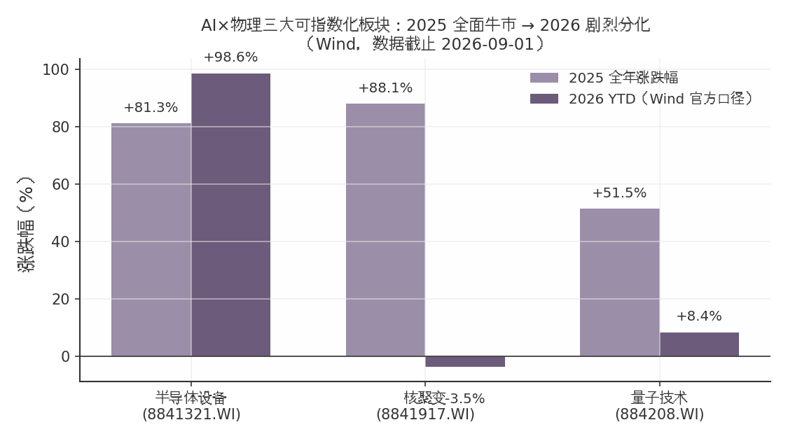

## 第一章 总览：框架、五域梯度与政策母题

### 1.1 范围界定：凝聚态/等离子体/粒子/冷原子/理论计算物理×AI 的工程化应用

最关键的界定性发现：2024–2026 年 AI 在物理各分支中已从"参数优化工具"升级为"决定性使能技术"。标志事件可量化：中科大团队以 AI 在 60 毫秒内完成 2024 个原子的无缺陷阵列重排（中国科大官网，2025-12-15）；DeepMind 开源模拟器 TORAX 已深度嵌入 CFS SPARC 研发流程（福建省科技厅转引，2026-02-12）。

据此，本报告界定五域：凝聚态物理（AI 材料计算）、等离子体物理（可控核聚变）、粒子物理（加速器/探测器技术外溢）、冷原子物理（量子计算与精密测量）、理论/计算物理（AI4Science 平台）。纳入口径为工程化判据——收入、订单、装备部署或仪器销售，而非论文产出；半导体设备作为凝聚态工程化最成熟的 A 股兑现载体，纳入梯度对照但不单列。

### 1.2 五域工程化成熟度梯度（半导体设备>量子精密测量>核聚变>AI 材料计算>粒子物理外溢）

核心发现：五域成熟度梯度清晰，且二级分化与一级火热明显错位。

| 域 | 成熟度判据 | 行情与估值（Wind，2026-09-01） | 标志事件 |
|---|---|---|---|
| 半导体设备 | 业绩兑现 | 指数 2025 年 +81.3%（首交易日基期，Wind 自算）、2026 YTD +98.6%；PE 113.9 倍 | 北方华创订单排至 2027Q1（界面新闻，2026-01-07） |
| 量子精密测量 | 上市+扭亏在望 | 量子技术指数 2025 年 +51.5%（首交易日基期，Wind 自算）、YTD +8.4%，PE 23 倍 | 国仪量子 2026-08-11 上市，实募约 8.49 亿元（原拟 11.69 亿元）、首日 +419.46%（新浪，2026-08-12；招股书/界面，2026-05~08） |
| 核聚变 | 订单周期启动 | 指数 2025 年 +88.1%（首交易日基期，Wind 自算；另一口径 +101%，长沙晚报，2026-01-05）、YTD -3.6% | 2026 年招标约 250 亿元、约为 2025 年 5 倍（国盛证券，2026-02-09） |
| AI 材料计算 | 商业化验证中 | 无板块指数；晶泰控股 YTD -23.9% | 晶泰 2025 年营收 8.03 亿元（+201.2%）首盈（美通社，2026-03-25）、2026H1 预亏 2.15–2.75 亿元（雪球转述，2026-08，公告原文待核） |
| 粒子物理外溢 | 标的稀疏 | 无独立板块，映射至科学仪器/加速器硬件链 | 辐照加速器市场 2024 年 244.79 亿元（智研咨询，2025-04-09） |

解读：梯度本质是收入可见度差异。半导体设备有同比约 80% 的订单增速支撑；量子精密测量已有 6.66 亿元年营收、三年复合增速 29.1%（招股书/36氪，2026-05 至 08）；核聚变收入依赖招标节奏，指数自 2026-03-10 高点回撤约 19.7%；粒子物理侧北方夜视、迈胜医疗等关键产业化主体均未上市，映射最弱。错位同样值得记录：量子赛道 2026 年上半年一级融资超百亿元，远超 2025 年全年约 25 亿元（凤凰网，2026-08-04）。

### 1.3 政策母题：十五五未来产业、2026 政府工作报告、国发〔2025〕11 号「AI+科学技术」

核心判断：五域共享同一政策母题——"未来产业+AI 赋能基础研究"双轨定调。"十五五"规划建议将量子科技列为六大未来产业之首、核聚变能并列（新华社，2025-10-24）；2026 年政府工作报告（2026-03-05）提出"建立未来产业投入增长和风险分担机制"；国发〔2025〕11 号将"人工智能+科学技术"列为六大重点行动之首（人民日报，2025-08-27）；2026 年 6 月证监会将量子科技纳入科创板重点支持领域（36氪，2026-08-11）。

对冲提示：政策密度虽处历史高位，定调向订单与利润的传导仍有时滞；各板块商业化时间表普遍早于 ITER DT 运行 2039、CFEDR 预计 2035 年建成的官方路线（ITER 官网，2024-07-03），执行风险不宜低估；估值端半导体设备 PE 113.9 倍、国盾量子 PE 6483 倍（Wind，2026-09-01）已明显透支。政策β 能否兑现为业绩α，是后续章节检验的主线。
