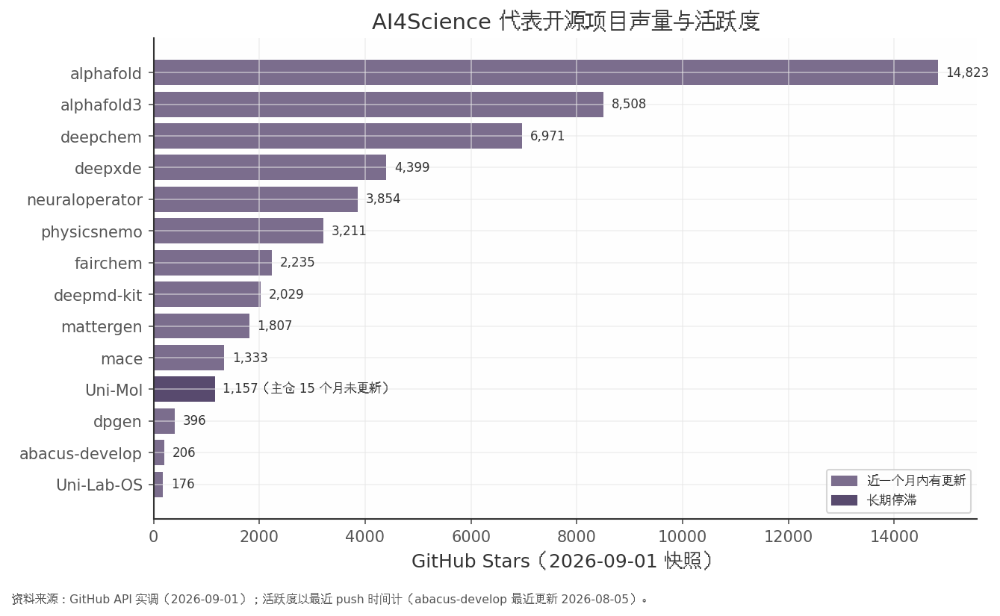

## 第六章 理论计算物理×AI：科学计算平台与开源生态

**核心发现：AI4Science 的商业化验证已经完成"从 0 到 1"——薛定谔软件收入逼近 2 亿美元、晶泰控股成为港股 AI4S 首家盈利公司，但 A 股至今没有"纯 AI4S"标的，只能通过 CAE 工业软件与算力底层间接映射；开源生态上，国产 DeepModeling 系工程活跃度不逊海外，star 量级却与头部相差一个数量级。**

### 6.1 科学基础模型与智能体平台

2025-2026 年，AI4Science 的技术架构已从"单点模型"升级为"基础模型+智能体平台"的双层竞争。微软在 Build 2025 发布科研智能体平台 Microsoft Discovery，内部曾用其以 200 小时筛选 36.7 万种候选物、发现非 PFAS 数据中心浸没冷却剂（微软/凤凰科技，2025-05-20）；其模型矩阵中 MatterGen 生成的 TaCr₂O₆ 目标模量 200GPa、实测 169GPa，Skala 1.1 于 2026 年开源（tistory 综述，2026-07-13）。NVIDIA 则走"物理 AI 基础设施"路线，PhysicsNeMo 以 Apache 2.0 开源，并与微软 Discovery 深度集成（NVIDIA 博客，2025-05-19）。

闭源商业化一极是 Alphabet 系 Isomorphic Labs：2025-03 完成 6 亿美元 A 轮（Thrive 领投），2026-05 完成 B 轮，金额为 12–21 亿美元（两口径并存，财联社 2026-05-12 与腾讯新闻 2026-05-18 报道不一致，本章按区间列示）；与礼来、诺华合作潜在总额近 30 亿美元，2026-01 又新增强生（同上）。国内方面，中科院"磐石·科学基础大模型"于 2025-11 发布 V1.5，支持 128K 上下文工具调用，新增波、谱、场三类科学数据能力（百度百科，2026-07-23 更新，单一来源）；北京科学智能研究院与深势科技联合发起的 OpenLAM 大原子模型计划中，DPA-2 已覆盖元素周期表 90% 以上元素，北京市同步出台《"人工智能+新材料"行动计划（2025-2027）》（新华网，2025-03-20）。

### 6.2 计算物理软件商业化：薛定谔对标与 CAE+AI 国产化

商业化的全球标尺是薛定谔（SDGR）：FY2025 总营收 2.559 亿美元（+23.3%），其中软件收入 1.995 亿美元（+10.6%）、毛利率 74%，药物发现收入 5,640 万美元（2024 年为 2,720 万），净亏损由 1.871 亿收窄至 1.033 亿美元；公司指引 2026 年软件 ACV 2.18–2.28 亿美元（+10–15%），目标 2028 年调整后 EBITDA 转正（ir.schrodinger.com，2026-02-25）。行业空间上，全球计算化学市场 2025 年为 15.9 亿美元，预计 2034 年达 44.4 亿美元，CAGR 12.44%（Fortune Business Insights，2026-08-10，第三方测算，权威级一般）。

| 公司 | 口径 | 收入/指标 | 同比 | 来源，日期 |
|---|---|---|---|---|
| 薛定谔 SDGR | FY2025 软件收入 | 1.995 亿美元 | +10.6% | 公司 IR，2026-02-25 |
| 晶泰控股 2228.HK | 2025 年营收 | 8.03 亿元 | +201.2% | 医药魔方/新浪，2026-03-25/27 |
| 索辰科技 688507 | 2025H1 营收 | 5,735 万元 | +10.82% | 华创证券，2025-09-04 |
| 霍莱沃 688682 | 物理 AI 收入（2025 中报口径） | 3,800 万元 | — | 公司公告，2025-08-28 |
| 中望软件 688083 | 2025 年 CAE 收入 | 1,181.7 万元 | +21.35% | 年报，2026-04-23 |

上表揭示了清晰的梯度差：晶泰 2025 年经调整净利 2.58 亿元、成为港股 AI4S 首家盈利公司，药物发现收入 5.38 亿元（+418.9%），并与 DoveTree 签订约 57–60 亿美元合作（两口径并存：医药魔方/新浪，2026-03-25/27；雪球梳理帖，2026-01-09），验证了"AI+计算物理"的付费意愿；而 A 股三家 CAE 公司相关收入合计仍不足 1 亿元人民币量级，中望 CAE 收入占总营收仅 1.43%。国产化的积极信号在于增速与结构：索辰工程仿真软件收入 1,682 万元、同比接近翻倍，并划分"天工（CAE）+开物（物理 AI）"双产品线（华创证券，2025-09-04）；2025Q1 霍莱沃、索辰营收增速均高于 Ansys（国金证券，2025-10-29）。但需对冲提示：物理 AI 快速仿真依赖足量高质量训练数据，数据受限可能使推广不及预期（中银证券，2025-06-30 经 EET 转引）——这是 CAE+AI 叙事的核心约束，短期内国产 CAE 收入体量对标薛定谔软件业务仍有约两个数量级差距。

### 6.3 开源生态实调与 A 股映射

*图注：stars 为 GitHub API 实调快照，活跃度以最近 push 时间计。资料来源：GitHub，2026-09-01。*

本章对 15 个代表项目做 GitHub 实调（GitHub API 实查，2026-09-01 快照，见附图 ai_sec06_github_stars.png）。头部项目高度活跃：alphafold 14,823 stars、alphafold3 8,508、deepchem 6,971、PhysicsNeMo 3,211，最近 push 均在 2026-08-31 至 2026-09-01；国产 DeepModeling 系工程同样活跃（deepmd-kit 2,029 stars/647 forks，dpgen 持续发版至 v0.11.x），但 star 量级与海外头部相差约一个数量级；值得警惕的是 Uni-Mol 主仓最近 push 停留在 2025-05-29，已 15 个月未更新。生态新趋势为智能体化科研工具（Uni-Lab-OS，2025-04 新建）与推理服务化（physicsnemo-serve，2026-06 新建）。

A 股映射呈"哑铃"结构：一端是 CAE/物理 AI 直接标的——索辰科技（市值约 95.7 亿元，2025-09-30）、霍莱沃、中望软件；另一端是算力底层——寒武纪 2025 年成为 A 股"股王"，海光信息换股吸收合并中科曙光（2025-05-25 公告）形成芯片-服务器-算力服务全链，工业富联市值 1.23 万亿元、列 A 股第九（新华财经，2025-12-31）。纯正 AI4S 标的集中于港股 18A（晶泰、英矽智能、剂泰科技 2026-05-27 上市首日 +126%），券商自 2026-08 起对"科学智能"关注度升温（财新，2026-08-23）。基准情形下，A 股 AI4S 敞口短期仍以"算力为主、CAE 为辅"定价；若国产 CAE 物理 AI 收入增速维持翻倍级且训练数据约束缓解，直接标的估值权重可能上移，反之则需警惕题材化回撤。
