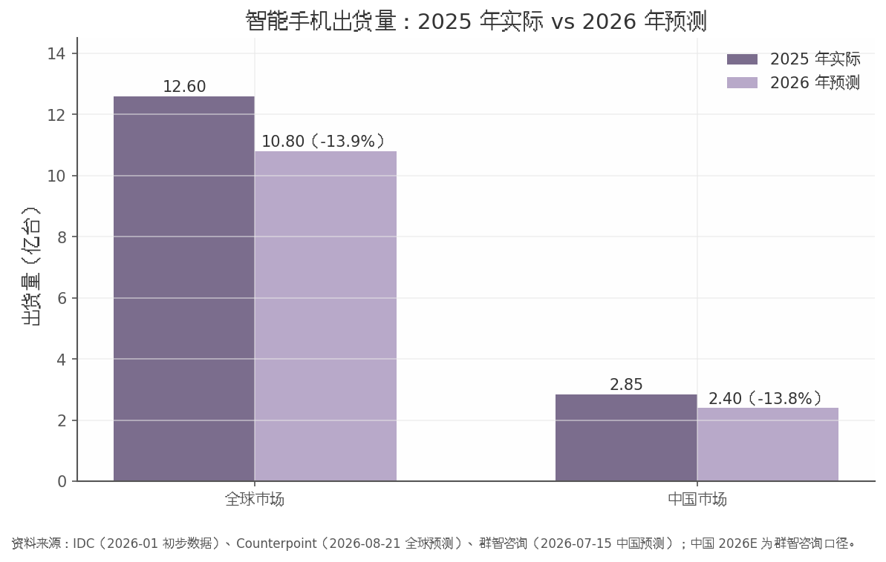
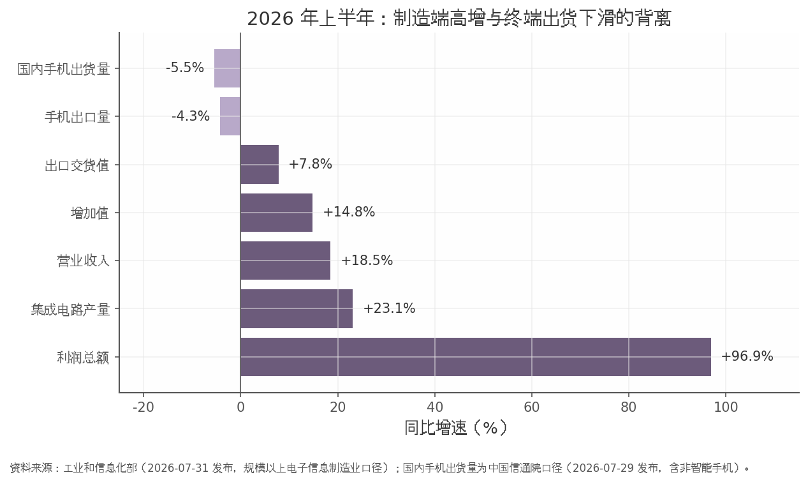
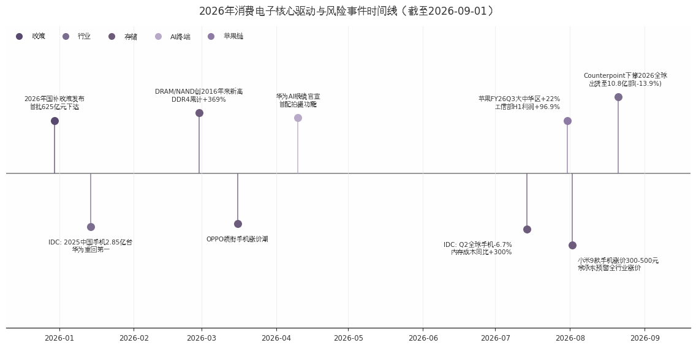
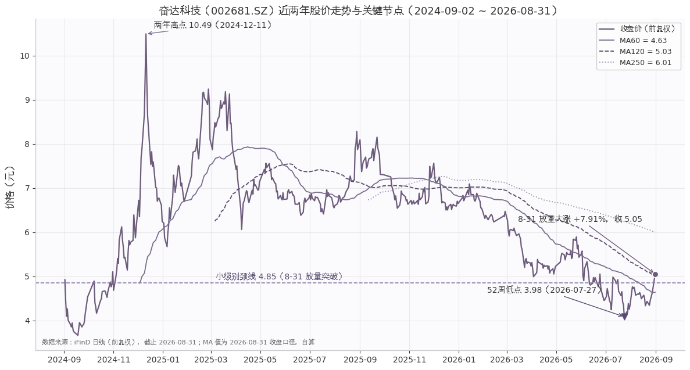

# 消费电子行业研报暨奋达科技（002681）反转研判

**报告日期：2026-09-01**｜数据基准：2026-08-31/09-01（各数据截止日期以文内标注为准）

> 本报告为研究分析，不构成投资建议。

## 第一章 行业总览：景气与总量

### 1.1 2025 年回顾：弱复苏收官

2025 年全球消费电子以"微增收官"定调：全年智能手机出货 12.6 亿台、同比仅 +1.9%（IDC 初步数据，2026-01 发布），复苏力度明显弱于年初预期。分市场看，增长主要由海外与头部厂商贡献——苹果约 2.48 亿台（+6.3%，按 IDC 披露份额 19.7% 还原推算）、三星 2.412 亿台（+7.9%）双双向好（IDC 初步数据，2026-01）；而中国市场全年出货约 2.85 亿台、同比 -0.6%，较 2024 年 +5.6% 的增速明显回落（IDC，2026-01-14）。国补政策上半年拉动、下半年因多地资金提前用尽而透支回落，是全年前高后低的主因（IDC，2026-01-14）。竞争格局上，华为以 4670 万台、16.4% 份额时隔五年重回中国第一，苹果与 vivo 各以 16.2% 并列第二（IDC，2026-01-14），头部集中度进一步抬升。

结构上，增量已从手机转向新终端：2025 年前三季度全球腕戴设备出货 1.5 亿台、+10.0%，其中中国市场 5843 万台、+27.6%（IDC，2025-12-17）；全球 AI 眼镜全年出货约 870 万台、同比 +322%（IDC，2026-04-15）。相比之下，传统品类动能衰减——全球 TWS 增速从 2025Q1 的 +18%（Canalys/Omdia，2026-05 报道）降至 Q3 的 +0.33%（Omdia，2025-12-12），智能音箱中国市场 Q3 销量 305.7 万台、-11.9%（洛图科技，2025-11-11）。弱复苏之下，行业的总量瓶颈已经显现。

### 1.2 2026 年急转：出货量连续下滑

进入 2026 年，行业景气由"弱复苏"转为"明确收缩"。2026Q2 全球智能手机出货 2.775 亿部、同比 -6.7%，为连续第二个季度下滑（IDC，2026-07-14）；中国市场 Q2 出货约 6601 万台、-4.3%，已连续五个季度同比负增长（IDC，2026-07-14）。上半年国内手机总出货 1.33 亿部、-5.5%，其中 6 月单月降幅达 -15.3%（中国信通院，2026-07-29）；"618"期间智能手机销量同比降幅接近 15%，国补拉动效应明显减弱（IDC，2026-07-14）。

| 指标 | 数值 | 同比 | 口径与来源 |
|---|---|---|---|
| 全球智能手机出货（2026Q2） | 2.775 亿部 | -6.7% | IDC，2026-07-14 |
| 中国智能手机出货（2026Q2） | 约 6601 万台 | -4.3% | IDC，2026-07-14 |
| 国内手机出货（2026H1） | 1.33 亿部 | -5.5% | 信通院，2026-07-29 |
| 全球全年预测（2026E） | 约 10.8 亿部 | -13.9% | Counterpoint，2026-08-21 |
| 中国全年预测（2026E） | 约 2.4 亿台 | -13.8% | 群智咨询，2026-07-15 |

上表显示，实际值与预测值方向一致：Q2 单季 -4.3%（IDC 口径）与 H1 累计 -5.5%（信通院口径）均处负增长区间，两口径统计范围不同、不宜直接比较斜率，但两大机构对全年 -13% 以上的下修与已发生的收缩趋势相互印证，属于对已发生趋势的外推而非保守假设。若下半年存储成本压力不缓解，实际值存在进一步低于预测的风险。

*图注：2025 年为实际值，2026 年为机构预测值。资料来源：IDC 初步数据（2026-01）、信通院（2026-07-29）、Counterpoint（2026-08-21）、群智咨询（2026-07-15）；预测口径各机构略有差异。*

本轮急转的核心约束是成本端。2026Q2 内存成本同比上涨近 300%，占低端手机 BOM 成本 65% 以上（IDC，2026-07-14）；AI 服务器抢占存储产能，原厂约 70% 先进产能转向 HBM 等 AI 用途（公开报道，2026-08）。OPPO 于 2026 年 3 月领衔上调部分机型价格，小米于 8 月上调 9 款机型售价 300–500 元（公开报道，2026-03/2026-08），终端涨价预计将进一步压制换机需求。

### 1.3 总量与结构的背离

终端出货收缩并未传导为制造端收缩，二者出现显著背离。2026H1 规模以上电子信息制造业增加值同比 +14.8%，营业收入 9.41 万亿元、+18.5%，利润总额 5777 亿元、+96.9%，集成电路产量 2798 亿块、+23.1%；同期手机出口 3.25 亿台、-4.3%（工业和信息化部，2026-07-31），国内手机出货 -5.5%（信通院，2026-07-29）。

*图注：制造端为规上电子信息制造业 2026H1 累计同比，终端为同期手机出货量同比。资料来源：工信部（2026-07-31）、信通院（2026-07-29）；两者统计口径不同，仅作方向性对照。*

背离的含义在于：本轮景气由 AI 算力与上游半导体驱动，而非终端消费驱动，利润正沿产业链向上游集中。对终端环节而言，总量机会让位于结构机会——OWS 开放式耳机 2026Q1 出货 1067 万台、+39.9%，渗透率升至 11.2%（IDC，2026-06-24）；全球智能眼镜 Q1 出货 356.6 万台、+130.1%，IDC 预计 2026 年全球消费级智能眼镜出货 2368.7 万台（IDC，2026-08-24 / 2026-06-17）；中国新一代 AI 手机 2026 年有望出货 1.47 亿台、+31.6%，占整体市场约 53%（IDC，2026-08-21）。总量下行周期中，新品类渗透与单机价值量提升预计成为行业抵御出货收缩的主要缓冲。

展望后续，背离格局的收敛路径取决于两条线索：其一，存储涨价向终端零售价的传导若在 2026 年下半年全面落地，需求端或面临二次压制，全年出货预测仍存在下修风险；其二，国补已延续至 2026 年并将智能眼镜纳入补贴范围、首批 625 亿元特别国债资金提前下达（发改委/财政部「两新」通知 2025-12-30 发布；资金下达据公开报道，2026-01），政策托底有望平滑下滑斜率，但参照"618"的表现，其边际效力预计弱于 2025 年。整体判断，行业景气中枢已从"量的复苏"切换为"价的博弈与结构切换"，总量指标对板块景气的解释力趋于下降。

## 第二章 细分赛道扫描

本章对消费电子五大细分赛道逐一扫描。核心结论先行：赛道间景气分化已达到近年极值——传统终端（手机、入耳式耳机、智能音箱）进入零增长或负增长区间，而 OWS 耳机与 AI/智能眼镜以 40%–322% 的同比增速成为仅有的高景气方向，腕戴设备则居中、由中国市场贡献主要增量。需要提示的是，各赛道最新可得数据的统计期并不一致（2025 全年至 2026Q1 不等），下文与图表均已逐一标注口径。

*图注：各赛道出货量同比增速对比。资料来源：IDC（智能手机/腕戴/OWS/AI 眼镜，2025-12 至 2026-08 期间发布）、Omdia（TWS，2025-12-12）、洛图科技（智能音箱，2025-11-11）；各条目数据期如图内标注，右图坐标量级与左图不同，不可直接比较。*

### 2.1 智能手机：存量博弈，华为/苹果逆势

智能手机是体量最大、但增长动能最弱的赛道：2025 年全球出货 12.6 亿台，同比仅 +1.9%（IDC 初步数据，2026-01 发布）。进入 2026 年后形势进一步走弱，2026Q2 全球出货 2.775 亿部、同比 -6.7%，为连续第二个季度同比下滑（IDC，2026-07-14）；Counterpoint 已将 2026 全年预测下修至约 10.8 亿部、同比 -13.9%（2026-08-21 报道）。

中国市场同样处于收缩通道。2025 年中国出货约 2.85 亿台、同比 -0.6%（IDC，2026-01-14）；2026H1 国内智能手机出货 1.26 亿部、同比 -3.0%（信通院，2026-07-29）；2026Q2 出货约 6601 万台、同比 -4.3%，为连续第五个季度同比下滑（IDC，2026-07-14）。结构上最突出的特征是头部逆势集中：2025 年华为以 4670 万台、16.4% 份额时隔五年重回中国第一，苹果 4620 万台紧随其后（IDC，2026-01-14）；2026Q2 大盘下跌中，华为、苹果在华出货仍逆势增长约 20%（IDC，2026-07-14）。全球市场亦呈类似格局——2026Q2 三星出货 6270 万台、+8.1% 居首，苹果 5510 万台、+23%（Omdia 口径，2026-08-03），而小米、OPPO、vivo 均出现两位数下跌（IDC，2026-07-14）。政策层面，"618"期间中国手机销量同比降幅接近 15%，显示国补拉动效应已明显减弱（IDC，2026-07-14）。

### 2.2 TWS 与 OWS 耳机：入耳式见顶，OWS 成新拐点

耳戴赛道的最重要发现是：增长引擎已完成从入耳式 TWS 向开放式耳机（OWS）的切换。全球 TWS 出货在 2025Q1 尚有 7800 万台、+18% 的扩张（Canalys/Omdia，2026-05-22 转发报道），但至 2025Q3 已降至 9260 万台、同比仅 +0.33%；其中传统入耳式 TWS 8200 万台、同比 -4%，而 OWS 单季突破 1000 万台、同比 +69%（Omdia，2025-12-12）。2026Q1 分化延续：全球耳戴设备总出货 9520 万台，其中 OWS 1067 万台、同比 +39.9%，占比升至 11.2%（IDC，2026-06-24 转引）。Omdia 预计 2026 年 OWS 出货将达 4000 万台、占 TWS 市场约 10%（2025-12-12）。竞争格局上，苹果仍以约 20% 份额居首但增速转负（2025Q3 出货 1890 万台、-4%），小米（860 万台、+24%）、华为（500 万台、+35%）持续蚕食份额（Omdia，2025-12-12）。渗透率突破 10% 通常被视为新品类的规模化拐点，OWS 大概率正处该窗口，但其能否对冲入耳式的存量下滑，仍取决于气传导耳夹等形态的均价下探速度。

### 2.3 智能可穿戴（腕戴）：中国增速领先全球

腕戴赛道呈现"全球温和增长、中国显著领跑"的双速格局。2025 年前三季度，全球腕戴（手表+手环）出货 1.5 亿台、同比 +10.0%，而中国市场出货 5843 万台、同比 +27.6%，增速约为全球的 2.8 倍（IDC，2025-12-17）。分品类看，手环弹性大于手表：同期全球手环出货 3286 万台、+21.3%，中国手环 1839 万台、+42.5%；中国智能手表 4004 万台、+21.8%，亦高于全球的 +7.3%（IDC，2025-12-17）。2026Q1 增速有所回落但仍为正：全球腕戴 4705 万台、+2.2%，中国 1814 万台、+3.5%；结构上成人手表 +15.3%、儿童手表 +22.4%，手环则 -22.2%（IDC《全球可穿戴设备市场季度跟踪报告》，2026-06-11）。厂商方面华为居全球第一（2026Q1 出货 950 万台、份额 20.2%），苹果 800 万台、+13.2%（IDC，2026-06-11）。IDC 预计 2026 年中国腕戴市场出货 7958 万台、+5.1%（2025-12-17），增速中枢较 2025 年明显收敛，但该预测发布较早，存在下修可能。

### 2.4 智能音箱：持续萎缩中的结构升级

智能音箱是五大赛道中唯一确定性收缩的品类：2025Q3 中国全渠道销量 305.7 万台、同比 -11.9%，降幅较上半年的 -5.6% 进一步扩大（洛图科技，2025-11-11）；2026Q1 中国线上销量 70.8 万台、同比 -41.8%，4 月单月线上仅 20.4 万台、-50.5%（洛图科技，2026-05-12/2026-05-31）。萎缩呈明显的价格分层：百元内低端产品销量 -65.4%，而千元以上高端产品 +16.3%；10 英寸以上大屏产品份额达 35.9%、同比提升 20.7 个百分点（洛图科技，2026-05-12）。集中度同步走高，小米以 53.5% 份额居首，百度、天猫精灵分别为 22.3%、20.5%（洛图科技，2026-05-12）。总量收缩叠加结构升级，意味着该赛道的投资机会已不在出货量，而在大屏化、高端化带来的单机价值量提升；洛图将下滑部分归因于补贴力度退坡（2026-05-12），若政策面无增量刺激，萎缩趋势短期或难逆转。

### 2.5 AI/智能眼镜：最高景气赛道

AI/智能眼镜是当前消费电子景气度最高、且唯一处于爆发期的赛道。2025 年全球 AI 眼镜出货约 870 万台、同比 +322%，其中 Meta（Ray-Ban）以超 700 万副占据绝对主导（IDC，2026-04-15 报道）。2026Q1 全球智能眼镜出货 356.6 万台、同比 +130.1%，其中音频/拍摄类眼镜 224.8 万台、+167.4%，AR/VR 类 131.8 万台、+85.9%（IDC，2026-08-24）。展望层面，IDC 预计 2026 年全球消费级智能眼镜出货 2368.7 万台，其中中国 491.5 万台，中国厂商出货占全球约 45%（IDC，2026-06/2026-08 发布）。需要对冲提示的是，该赛道基数仍低（全球年出货不足手机的 1%），预测兑现依赖巨头新品节奏与消费者接受度，波动风险显著高于成熟品类。

| 赛道 | 最新规模与增速 | 数据期/口径 | 来源（发布日期） |
|---|---|---|---|
| 智能手机（全球） | 12.6 亿台，+1.9% | 2025 全年 | IDC，2026-01 |
| 智能手机（中国） | 约 2.85 亿台，-0.6% | 2025 全年 | IDC，2026-01-14 |
| TWS（全球） | 9260 万台，+0.33% | 2025Q3 | Omdia，2025-12-12 |
| OWS（全球） | 1067 万台，+39.9% | 2026Q1 | IDC，2026-06-24 |
| 腕戴（全球） | 1.5 亿台，+10.0% | 2025 前三季 | IDC，2025-12-17 |
| 腕戴（中国） | 5843 万台，+27.6% | 2025 前三季 | IDC，2025-12-17 |
| 智能音箱（中国全渠道） | 305.7 万台，-11.9% | 2025Q3 | 洛图科技，2025-11-11 |
| AI 眼镜（全球） | 约 870 万台，+322% | 2025 全年 | IDC，2026-04-15 |
| 智能眼镜（全球） | 356.6 万台，+130.1% | 2026Q1 | IDC，2026-08-24 |

上表将九组口径不一的数据并置后，赛道梯度清晰可见：以增速排序，AI/智能眼镜（+130.1%~+322%）独居第一梯队，OWS（+39.9%）与中国腕戴（+27.6%）构成第二梯队，全球腕戴（+10.0%）居中，手机与 TWS 处于零增长边缘，智能音箱则以两位数负增长垫底。规模维度上，手机（12.6 亿台）与腕戴（1.5 亿台）决定行业总量，而 AI 眼镜（870 万台）虽增速最高，绝对规模尚不足手机的百分之一，短期难以扭转行业总量颓势。这意味着板块内部的配置逻辑应是"存量赛道看份额集中（华为/苹果/小米），增量赛道看渗透率弹性（OWS、AI 眼镜）"，而非追逐总量贝塔。

上述分化并非随机扰动，其背后是存储成本、AI 终端创新与以旧换新政策三条主线的共同作用，第三章将逐一展开。

## 第三章 核心驱动与风险因素

本章核心判断：2026 年消费电子行业处于"成本冲击与结构创新对冲"的格局——存储超级周期构成全年最大利空并压制终端量价，AI 终端（AI 手机、智能眼镜、OWS）贡献主要结构性增量，国补政策延续但边际拉动明显衰减，苹果链与华为链成为弱市中的两条确定性主线。预计全年全球智能手机出货同比降幅约 11%–14%（Counterpoint -13.9% 与群智咨询 -11.3% 的预测区间，2026-08-21 / 2026-07-15 发布），板块盈利分化将进一步加剧。

### 3.1 存储超级周期：成本冲击与涨价传导

**存储涨价是 2026 年行业最大的单一风险变量，其对终端利润的挤压已从预期转为现实。** 截至 2026 年 2 月，全球 DRAM 与 NAND Flash 价格创 2016 年以来新高，DDR4 8Gb 现货价自 2025 年低点 3.2 美元涨至约 15 美元，累计涨幅约 369%（国家发改委价格监测中心，数据截至 2026-02-28，经 36氪 2026-03-12 报道）。根因在于 AI 服务器对 HBM 的虹吸：存储原厂约 70% 先进产能转向 AI 需求（公开报道，2026-08），SK 海力士披露 DRAM/NAND 库存仅约 4 周、2026 年 HBM 产能已售罄，存储进入典型卖方市场（SK 海力士高盛电话会，2026-03 报道）。

成本冲击沿 BOM 向终端传导：2026Q2 内存成本同比上涨近 300%，占低端手机 BOM 成本 65% 以上（IDC，2026-07-14 发布）。涨价潮随之启动——OPPO 自 2026-03-16 起上调部分机型价格，小米于 2026-08-02 上调 9 款手机售价 300–500 元，余承东公开预警"所有手机都可能大规模涨价"（中新经纬/新浪，2026-08）。其直接后果是需求端下修：Counterpoint 将 2026 年全球智能手机出货预测降至约 10.8 亿部、同比 -13.9%（2026-08-21 报道），群智咨询预计 10.6 亿台、-11.3%（2026-07-15）。对冲来看，涨价若顺利传导将改善品牌商收入结构，但低端机型与新兴市场需求的弹性损失恐难以完全弥补；上游存储模组、主控及具备成本转嫁能力的头部整机厂相对受益。

### 3.2 AI 终端浪潮

**AI 终端是行业唯一确定的结构性增量，其中智能眼镜增速量级远超手机。** IDC 预计 2026 年中国新一代 AI 手机出货 1.47 亿台、同比 +31.6%，占整体市场 53%（IDC，2026-08-21 报道）；苹果 iPhone 18 标准版被传评估升级至 9GB RAM 以支撑端侧 AI（群智咨询，2026-07-15），端侧算力军备竞赛已开始反向拉动存储单机容量——这与 3.1 节的涨价压力形成螺旋。

新载体端，2025 年全球 AI 眼镜出货约 870 万台、同比 +322%（IDC，2026-04-15 报道）；2026Q1 全球智能眼镜出货 356.6 万台、同比 +130.1%（IDC 官网博客，2026-08-24）。IDC 预计 2026 年全球消费级智能眼镜出货 2368.7 万台，其中中国 491.5 万台，中国厂商占全球约 45%（IDC，2026-06-17 / 2026-08-28）。音频端，OWS 开放式耳机 2026Q1 出货 1067 万台、+39.9%，渗透率突破 11%（IDC，2026-06-24）；Omdia 预计 2026 年 OWS 全年出货 4000 万台、占 TWS 市场 10%（2025-12-12）。苹果智能眼镜项目或于 2026–2027 年进入量产窗口（IDC，2026-08-24），若兑现，2027 年或成为智能眼镜从尝鲜品转向大众品类的拐点。

### 3.3 以旧换新国补：延续但拉动减弱

**2026 年国补政策标准延续、品类扩容，但对销量的边际拉动已显著衰减。** 国家发改委、财政部 2025-12-30 发布通知：手机、平板、智能手表手环、智能眼镜 4 类数码产品（单价 ≤6000 元）按售价 15% 补贴、每件上限 500 元，新增智能眼镜与智能家居品类，首批 625 亿元超长期特别国债资金提前下达（IT之家/新华网，2025-12-30 / 2026-01-05）。然而效果评估偏负面：2025 年多地补贴资金上半年即用尽、下半年透支回落（IDC，2026-01-14）；2026 年"618"期间中国智能手机销量同比降幅接近 15%（IDC，2026-07-14）；洛图科技亦将智能音箱下滑归因于"补贴政策力度不如从前"（2026-05-12）。在存储涨价推高终端售价的背景下，固定上限 500 元的补贴对实际支付价格的稀释作用被动减弱，预计 2026 年下半年国补对出货的拉动将延续低个位数贡献，难以逆转总量下行。

### 3.4 苹果链与华为链动态

**总量下行中，苹果与华为构成仅有的两条逆势增长链。** 苹果 FY2026Q3（截至 2026 年 6 月季）营收 1094 亿美元、+16%，其中大中华区 188.16 亿美元、+22%，iPhone 中国大陆销量 +24%（苹果财报，2026-07-31）；此前 FY2026Q1 大中华区营收 255.3 亿美元、+38%（苹果财报，2026-01-29）。iPhone 17 系列 2026Q1/Q2 备货同比分别 +52%/+84%（群智咨询，2026-07-15），但毛利率 50.1% 已反映存储涨价对硬件成本的压制（苹果财报，2026-07-31）。折叠 iPhone 预计 2026 年底入局、首年份额或超 22%（IDC，2026-03-13），为苹果链提供新品类期权。

华为 2025 年以 4670 万台、16.4% 份额时隔 5 年重回中国市场第一（IDC，2026-01-14）；2026H1 以 20.6% 出货份额居国内第一（信通院/IDC/Counterpoint 汇总，2026-08-10 新浪），2026Q2 出货同比约 +20%（IDC 口径，2026-07-14）。华为 AI 眼镜于 2026 年 4 月亮相、首配拍摄功能（腾讯新闻/财联社，2026-04-10），HarmonyOS 折叠机 2026 年出货量预计接近翻倍（IDC，2026-03-13）。两条链的共同特征是高端化对冲总量收缩，国产供应链中摄像头模组、折叠屏铰链、电声 SoC 等环节的份额弹性或优于行业整体。

| 日期 | 事件 | 性质 |
|---|---|---|
| 2025-12-30 | 2026 年"两新"政策发布，国补延续并新增智能眼镜品类（IT之家/新华网） | 政策 |
| 2026-02-28 | DRAM/NAND 价格创 2016 年以来新高（发改委价格监测中心） | 风险 |
| 2026-03-16 | OPPO 领衔手机涨价潮（36氪） | 风险传导 |
| 2026-04-10 | 华为 AI 眼镜官宣（腾讯新闻/财联社） | 驱动 |
| 2026-07-14 | IDC：2026Q2 全球手机 -6.7%、内存成本 +300% | 风险确认 |
| 2026-07-31 | 苹果 FY26Q3 大中华区 +22%（苹果财报） | 驱动 |
| 2026-08-02 | 小米 9 款机型涨价 300–500 元（中新经纬/新浪） | 风险传导 |
| 2026-08-21 | Counterpoint 下修 2026 全球出货至 10.8 亿部（-13.9%） | 风险确认 |

**时间线解读：** 上表与图 1 显示，2026 年行业叙事呈"政策托底开局—成本冲击主导—龙头逆势突围"三阶段。上半年国补资金下达与华为年报登顶曾短暂支撑市场情绪，但 2 月末存储价格数据确认后，3 月起涨价传导与出货下修交替出现，7 月成为风险集中确认期（IDC 出货数据、内存成本数据、板块单月 -24.7% 均落在此窗口）；8 月苹果财报与华为份额数据则显示冲击并非均匀分布，高端与国产替代主线吸收了大量避险配置。这一节奏提示：后续跟踪的关键节点是存储合约价的环比拐点与 2027 年国补政策的续期力度，二者将决定本轮总量收缩的持续时长。

## 第四章 A 股消费电子板块：行情与估值

### 4.1 板块行情：近一年 +19.87%，2026 年 V 形震荡

截至 2026 年 9 月 1 日，消费电子(申万)指数（801085.SI）收报 10209.64 点，近一年（250 个交易日）累计上涨 19.87%，但年初至今涨幅仅 1.64%，当日下跌 2.07%（Wind，截至 2026-09-01）。"年度正收益、年内近零"的组合背后，是 2026 年以来板块罕见的大幅双向波动：52 周高点 13295.40 点与低点 8466.89 点之间的最大振幅达 57.0%（Wind，截至 2026-09-01）。

月 K 数据呈现三段式"V 形—冲高—急跌"轨迹。第一段为缩量下行：自 2025 年 9 月收盘 10720.35 点起步，板块连月走弱，2026 年 3 月收报 8966.88 点（盘中最低 8481.03 点），区间累计下跌 16.4%（Wind 月 K，截至 2026-09-01）。第二段为放量主升：2026 年 4—6 月连续三根长阳，6 月收报 12598.57 点（盘中最高 13295.39 点），三个月反弹 40.5%；月成交额由 2 月的 8596 亿元放大至 6 月的 2.61 万亿元，放量逾两倍（Wind 月 K，截至 2026-09-01），对应苹果链备货上修与 AI 终端预期发酵。第三段为急跌修复：7 月单月暴跌 24.7%，收报 9489.20 点，几乎抹平二季度全部涨幅，主要背景是存储芯片涨价对终端 BOM 成本的冲击与全年出货预测的连续下修（IDC 估算 2026Q2 内存成本同比上涨近 300%，2026-07-14 发布）；8 月板块反弹 9.9% 收报 10425.23 点；9 月 1 日板块再度回调 2.07%，修复节奏仍有反复（Wind 月 K，截至 2026-09-01）。

### 4.2 估值水平与申万电子对照

估值层面最核心的事实是"绝对估值不低、历史分位偏低、相对电子大板块深度折价"。行情快照口径下，消费电子(申万)市盈率（TTM）38.18 倍、市净率 4.57 倍；Wind 基本面口径下 PE(TTM) 为 34.4 倍、PB 4.47 倍，最新 PE 处于 6244 个交易日历史样本的约 29.0% 分位（Wind，截至 2026-09-01；两工具聚合口径不同，并列列示，未强行统一）。

| 指标 | 消费电子(申万) 801085.SI | 电子(申万) 801080.SI |
|---|---|---|
| 收盘点位 | 10209.64 | 8692.78 |
| 年初至今涨跌幅 | +1.64% | +32.63% |
| 近一年（250 日）涨跌幅 | +19.87% | +56.87% |
| 市盈率（TTM） | 38.18 倍（快照）/ 34.4 倍（基本面） | 82.19 倍 |
| 市净率 | 4.57 倍 / 4.47 倍 | 6.48 倍 |
| PE 历史分位 | 约 29.0%（6244 个交易日样本） | 未获取 |

（数据来源：Wind，截至 2026-09-01）

对照表揭示的是一轮典型的结构性定价分化。消费电子相对电子大板块的 PE 折价约 53%–58%，近一年收益落后约 37 个百分点，差距主要源于资金按"AI 算力链—终端消费链"两条线重新定价：电子大板块内的半导体与算力硬件受 AI 服务器需求驱动景气上行，而消费电子子板块直接承受终端出货疲软与存储涨价对毛利率的双向挤压，估值扩张缺乏业绩支撑。需要指出的是，约 29.0% 的历史 PE 分位意味着当前定价已隐含相当程度的悲观出货预期，板块估值安全边际有所改善，但"低分位"本身不构成买入理由——若 2027 年存储成本压力缓解、国补与 AI 手机换机周期兑现，板块具备估值修复弹性；反之，若终端涨价对需求的压制超预期，盈利下修可能令静态低分位失效，估值与盈利的匹配度仍需以出货数据逐季验证。

## 第五章 奋达科技（002681）个股分析与反转研判

本章核心结论前置：奋达科技短期（日/周级别）已出现反转雏形——52 周（日历口径）低点 3.98 元（2026-07-27）之后低点抬高、2026-08-31 以约 3 倍量突破小级别颈线 4.85 元并站上 MA60；但中长期（季/年级别）下行趋势未扭转，股价仍低于 MA250 约 16%。技术面处于「超跌反弹升级为短期趋势反转的确认窗口期」，基本面仅呈弱修复，综合把握评级为【一般】。

### 5.1 公司概况与主营构成

奋达科技主营消费电子整机及核心部件，覆盖电声产品（多媒体音箱）、健康电器（美发小家电）、智能门锁与智能可穿戴四条产品线，客户包括 WalMart、Amazon、LG、华为、阿里、百度、Philips、Amazfit、Keep 等（iFinD 公司资料，2026-09-01；东方财富 F10，2026-09-01）。公司是典型的出口型代工企业，2025 年报海外收入占比 71.9%（iFinD 主营构成，2025 年报），2026H1 降至 57.4%（iFinD，2026-08-29），关税与汇率是其盈利的两个核心外生变量。

2025 年报分部数据显示结构分化明显：电声收入 13.96 亿元（同比 -15.93%，毛利率 18.21%，同比 -6.88pct），健康电器 7.07 亿元（-19.11%，毛利率 19.11%），智能门锁 2.31 亿元（毛利率仅 3.00%），智能可穿戴 0.95 亿元（**-49.36%**，毛利率 10.57%）（iFinD 主营构成，2025 年报，2026-04-29）。2026H1 可穿戴收入 0.62 亿元、同比 +3.13% 止跌企稳，智能戒指、智能录音卡、智能头盔、智能哑铃等新品获核心客户认可并批量出货（2026 年半年报，巨潮资讯，2026-08-29），这是收入结构中唯一的边际亮点，但体量尚小（占 H1 营收不足 5%）。

### 5.2 基本面：2025 亏损归因与 2026H1 弱修复

2025 年是公司上市以来少见的亏损年：归母净利润 -0.83 亿元、同比 -185.6%（iFinD，2025 年报，2026-04-29），亏损由三重因素叠加——美国关税冲击下海外客户下单意愿降低并压价（营收 -13.76% 至 27.12 亿元）、机器人/智能硬件研发投入加大（研发费用 +3789.57 万元）、汇兑损失与递延所得税资产转回（2025 年年度报告全文，同花顺转载，2026-04-29）。

| 指标 | 2023A | 2024A | 2025A | 2026Q1 | 2026H1 |
|---|---|---|---|---|---|
| 营业收入（亿元） | 28.91 | 31.44 | 27.12（-13.76%） | 5.61（-26.15%） | 13.47（+6.86%） |
| 归母净利润（亿元） | 0.45 | 0.97 | **-0.83** | -0.16 | **+0.037（扭亏）** |
| 扣非归母（亿元） | — | — | -1.03 | -0.20 | **-0.066（仍亏）** |
| 毛利率 | 21.7% | 23.0% | 20.2% | 19.8% | 19.8% |
| 资产负债率 | — | 49.8% | 52.3% | 51.7% | 52.3% |
| 经营现金流净额（亿元） | — | — | 2.01（-65.6%） | — | 0.28（-62.8%） |

（来源：iFinD 财务报表，各期截止日为报告期末；2025 年报增速与现金流引自 2025 年年度报告，2026-04-29；2026H1 扣非与现金流引自半年报摘要，巨潮资讯，2026-08-29）

该表揭示三点。第一，拐点信号真实存在但成色不足：2026Q2 单季归母约 +1953 万元、同比 2025Q2 单季约 -2331 万元实现扭亏（自算自 iFinD 各期报表），公司披露「第二季度单季净利润同比增长 183.61%」（新浪财经，2026-08-29）；然而 H1 扣非归母仍为 -661.2 万元（巨潮资讯，2026-08-29），盈利修复尚未穿透非经常性损益层面。第二，盈利质量仍在恶化通道：毛利率 23.0%→20.2%→19.8% 连续下行（iFinD，2024A~2026H1），H1 营收转正但原材料涨价超预期、价格传导滞后，人民币升值带来汇兑损失（Q1 财务费用 1671 万元）（业绩预告，2026-07-15；半年报，2026-08-29）。第三，现金流同步走弱，H1 经营现金流净额 0.28 亿元、同比 -62.8%（巨潮资讯，2026-08-29），叠加有息负债大增 34%、应收账款高企（投资者关系活动记录，全景路演，2026-05-19），资产负债表修复慢于利润表。

### 5.3 技术面反转研判：短期底部结构 vs 中长期下行未扭转

本节最重要发现：2026-08-31 单日成交 1.18 亿股、成交额 5.85 亿元、约为此前 20 日均量（3888 万股）3 倍的放量大涨（+7.91%，收 5.05 元），向上突破 8-04 反弹高点 4.85 元这一小级别颈线，与 8-24 回踩 4.28 元（未破 3.98，低点抬高）共同构成「低点抬高 + 颈线突破」的短期底部结构（自算自 iFinD 日线，截止 2026-08-31；新浪财经，2026-08-31）。

| 维度 | 数据（截止 2026-08-31，iFinD 日线，前复权） |
|---|---|
| 最新价 / 52 周（日历口径）高低 | 5.05 元；高 8.17 元（2025-09-23），低 **3.98 元（2026-07-27）** |
| 现价区间位置 | 52 周区间 25.5% 分位；距低点 +26.9%，距高点 -38.2% |
| 均线 | MA60=4.63（已站上，+9.0%）；MA120=5.03（+0.5%，正在测试）；MA250=6.01（-15.9%，仍在其下） |
| 均线斜率 | MA60 近 20 日 -6.2%（下行趋缓）；MA250 近 60 日 -7.8%（长期下行未扭转） |
| 阶段涨跌 | 近 5 日 +16.4%；近 60 日 -2.3%；近 250 日 **-29.9%** |
| 量能 | 20 日均量 4140 万股 ≈ 120 日均量的 0.92 倍（整体未放量）；8-31 单日 1.18 亿股（约 3 倍量） |
| 上方压力 | MA120≈5.03；2026-07-13 高点 5.26；2026-05 高点 5.96；MA250≈6.01 |

（来源：iFinD 日线 483 个交易日，2024-09-02~2026-08-31，自算；8-31 量能交叉验证自新浪财经，2026-08-31）

解读：该结构的性质是「下跌趋势中的第一次底部结构」而非已确认的趋势反转。多头证据集中在短期：8-31 突破颈线时量能放大至约 3 倍，9-01 盘中续涨至约 5.18 元（+2.57%，iFinD 实时行情，2026-09-01 14:59），5 分钟口径 RSI6=69.3、KDJ J 值 102.5、ADX=26.6 且 PDI（21.7）显著大于 MDI（9.1）（iFinD 实时技术指标，2026-09-01 15:00）。但空头结构未被破坏：股价自 2025-09-23 高点 8.17 元至 2026-07-27 低点最大回撤 -51%，MA250 持续下压且现价低于其约 16%，20 日均量与 120 日均量基本持平意味着底部尚未经历充分的筹码换手。KDJ 超买亦提示短线追高的赔率不佳。**短期确认信号**：站稳 MA120（约 5.0 元）并相继突破 5.26、5.96 元两级前高；**破坏信号**：跌回 4.28 元下方，底部结构失效，3.98 元低点将重新接受测试。

上图（数据来源：iFinD 日线，前复权，截止 2026-08-31）直观呈现两年完整周期：2024-09-18 低点 3.61 元 → 2024-12-11 高点 10.49 元（涨幅约 190%）→ 此后 20 个月重心持续下移，MA60/MA120/MA250 依次下穿形成空头排列。8-31 的放量突破发生在三条均线全部下压的背景中，意味着本轮反弹是在对抗季、年级别的趋势惯性，确认成本高于一般底部。

### 5.4 催化剂：机器人/端侧 AI/可穿戴新品、回购、筹码集中

潜在的边际催化有四类，但均需跟踪兑现节奏而非线性外推。**其一，机器人与 AI 硬件**：与银河通用联合打造的 S1 重载机器人实现量产交付、入驻动力电池产线（多家媒体，2026-08-19）；为一家登上央视马年春晚的北京头部机器人公司代工整机并小规模出货；AI 棋类机器人「元萝卜」（与商汤合作）连续多年居主流电商平台智能机器人品类销量第一；消费级陪伴机器人与多家新客户达成意向，**有望 2026 下半年商业化落地并量产交付**（2026 半年报，2026-08-29；东方财富 F10，2026-09-01）。**其二，回购**：2025-09-02~2026-04-07 累计回购 1286.30 万股（占总股本 0.72%）、金额 7778.5 万元、价格区间 5.05~7.78 元/股，用于股权激励（回购结果公告，2026-04-08）——回购价中枢显著高于现价，构成心理锚而非价格底。**其三，筹码集中**：股东户数由 2026-03-31 的 18.19 万户（-11.07%）降至 2026H1 末的 16.73 万户（环比 -8.0%，同比 -18.8%）（iFinD 股东信息，2026-09-01；新浪财经，2026-08-25）。**其四，杠杆资金低仓位**：8-31 融资余额 3.71 亿元、占流通市值 4.09%，低于近一年 10% 分位（搜狐证券，2026-08；新浪财经，2026-09-01），若趋势确认存在补仓空间。

资金面同时给出对冲信号：8-31 大涨日前后近 3 日主力净流入 6668 万元（新浪财经，2026-08-31），但 9-01 盘中主力净流出约 4573 万元、小单净流入 7699 万元，呈「主力兑现、散户接力」迹象（东方财富，2026-09-01 14:44）——题材催化下的第一波拉升正在换手，持续性待验。

### 5.5 风险：高质押与减持、盈利质量、覆盖缺失

风险前置是本章结论的必要前提。**第一，控股股东风险敞口大**：肖奋 2025-09-12 减持 2481 万股（公告）；2025-06 向高新投非交易过户 3937.68 万股（2.19%）（简式权益变动书，2025-06-24）；2026-04 协议转让 8000 万股、价格 4.15 元（东方财富，2026-09-01）；控股股东及一致行动人**累计质押占其持股 80.32%**（公告报道，2026-06-04），2026-07-31 全公司质押总比例 13.85%（东方财富），2026-08-10 触发「质押鹰眼风险评级」。4.15 元的协议转让价与 80% 的质押率叠加，意味着股价若再度深跌可能引发被动抛压的负反馈。**第二，盈利质量**：2026H1 扣非仍亏 661 万元，毛利率连续两年下滑，TTM 归母约 -0.97 亿元仍为亏损（自算自 iFinD 报表，2026-09-01）。**第三，覆盖缺失与估值矛盾**：iFinD 盈利预测字段全空、无券商覆盖（iFinD，2026-09-01；经济观察网，2026-08-07）；PB-MRQ 4.33 倍（iFinD，2026-09-01）对一家 TTM 亏损企业并不便宜，所谓「估值历史低位」仅指 PE 分位（近 5 年约 13.8%~15.9% 分位，经济观察网，2026-08-07/08-25）。此外，2026-01-21 变更总经理、2026-07-17 独立董事辞职（iFinD 公告），治理层面亦有扰动。

### 5.6 研判结论（把握三档）

**是否反转，分两个层级回答。**

- **短期（日/周级别）：反转雏形已现，处于确认窗口期——把握【比较确定】有底部结构、【一般】能否走成趋势。** 「低点抬高（3.98→4.28）+ 约 3 倍量突破颈线 4.85 + 站上 MA60」三要素齐备（iFinD 日线，截止 2026-08-31）。确认信号：站稳 MA120（约 5.0 元）、放量突破 5.26/5.96 两级前高、主力资金由兑现转为持续净流入。破坏信号：跌回 4.28 元下方，或机器人/陪伴机器人新品商业化不及「2026 下半年量产交付」的披露节奏。
- **中长期（季/年级别）：尚未反转——【再看看】。** MA250 下压、现价低于其约 16%、250 日跌幅 -29.9%（iFinD 日线，截止 2026-08-31），TTM 亏损、扣非未转正、毛利率下行未止（iFinD 报表，2026H1，2026-08-29）。中长期确认需要基本面与技术面共振：季度扣非转正、毛利率企稳回升，叠加股价收复 MA250（约 6.0 元）并使其走平上翘。

综合而言，本轮行情的性质更接近「超跌反弹 + 题材催化（机器人/端侧 AI）+ 业绩弱修复」的组合，而非基本面驱动的趋势反转。控股股东 80.32% 的高质押与 4.15 元协议转让价是悬顶之剑，无券商覆盖意味着缺乏盈利预期的外部校准。投资者应以后续确认/破坏信号的触发情况动态修正判断，本报告不构成任何买卖指令式建议。

## 第六章 投资逻辑总结与风险提示

### 6.1 行业层面逻辑与配置线索

前五章结论可归纳为三条主线。**其一，总量收缩与结构爆发并存，总量贝塔让位于赛道阿尔法。** 全球智能手机 2025 年以 12.6 亿台、+1.9% 弱复苏收官（IDC 初步数据，2026-01），2026Q2 转为 -6.7%（IDC，2026-07-14），全年预测已下修至约 -13.9%（Counterpoint，2026-08-21）；同期 2026H1 电子信息制造业利润 +96.9%（工信部，2026-07-31），指向利润向上游算力链集中。配置含义：赛道梯度（AI 眼镜 +322% > OWS +39.9%~69% > 中国腕戴 +27.6% > 手机/TWS 存量 > 智能音箱萎缩）决定相对收益，"存量看份额集中、增量看渗透弹性"是更可行的框架。**其二，估值已部分定价悲观预期。** 申万消费电子 PE(TTM) 基本面口径 34.4 倍、历史约 29.0% 分位，较申万电子（82.19 倍）深度折价（Wind，截至 2026-09-01）；若 2027 年存储成本缓解、AI 手机换机（1.47 亿台预期，IDC，2026-08-21）兑现，板块或有修复弹性，反之低分位可能因盈利下修失效。**其三，存储是贯穿全局的定价变量**，DDR4 现货 +369%、2026Q2 内存成本同比近 +300%（发改委价格监测中心，截至 2026-02-28；IDC，2026-07-14），合约价环比拐点为首要跟踪指标。

### 6.2 奋达科技（002681）研判结论重述

个股呈"短期底部结构已现、中长期下行未扭转"的二元格局。短期三要素齐备：3.98 元低点后抬高至 4.28 元、8-31 约 3 倍量突破颈线 4.85 元、站上 MA60（iFinD 日线，截止 2026-08-31）；中长期约束未解——股价低于 MA250 约 16%、TTM 亏损、扣非未转正、毛利率连续下行（iFinD，2026H1，2026-08-29）。综合把握维持【一般】：确认信号为站稳 MA120（约 5.0 元）并突破 5.26/5.96 两级前高，破坏信号为跌回 4.28 元下方。本轮行情性质更接近"超跌反弹 + 题材催化 + 业绩弱修复"的组合，而非基本面驱动的趋势反转。

### 6.3 风险提示（行业+个股）

**行业风险：** 其一，存储超级周期延续——若产能持续向 HBM 倾斜、涨价向终端全面传导，全年出货实际值可能低于 -13.9% 的当前预测；其二，出货量连续下滑，中国 Q2 已连五个季度负增长（IDC，2026-07-14）；其三，国补退坡，"618"销量降幅近 15% 表明拉动明显减弱（IDC，2026-07-14）；其四，口径与预测不确定性——各赛道统计期不一、机构预测屡经下修，AI 眼镜等高增速品类基数低，兑现依赖巨头新品节奏。

**个股风险：** 其一，质押与减持——控股股东及一致行动人累计质押占其持股 80.32%（公告报道，2026-06-04），叠加 4.15 元协议转让价（东方财富，2026-09-01），股价深跌可能触发被动抛压负反馈；其二，盈利质量——2026H1 扣非仍亏 661 万元、毛利率连续两年下滑（巨潮资讯，2026-08-29）；其三，流动性与覆盖——无券商覆盖、盈利预测字段全空，缺乏外部预期校准；其四，技术面破坏条件——跌回 4.28 元下方则底部结构失效，3.98 元低点将重新接受测试。

本报告为研究分析，不构成投资建议。

## 附：主要数据来源

- 行业数据：IDC、Omdia/Canalys、Counterpoint、群智咨询、信通院、工信部、洛图科技（RUNTO）公开报道与发布；Wind（申万指数行情/估值，截至 2026-09-01）；新华财经；gildata。
- 个股数据：iFinD（同花顺，日线/财务/公告/股东，截至 2026-08-31/09-01）；公司 2025 年报、2026 年半年报及业绩预告；新浪财经、东方财富、证券之星、经济观察网等公开报道。
- 各数字的具体来源与截止日期以正文紧邻标注为准；原始数据已随研究过程留存归档。
