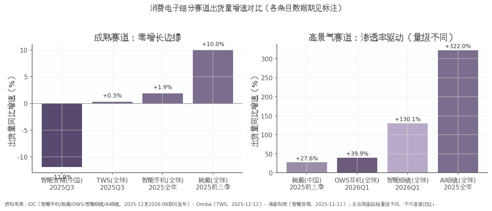

## 第二章 细分赛道扫描

本章对消费电子五大细分赛道逐一扫描。核心结论先行：赛道间景气分化已达到近年极值——传统终端（手机、入耳式耳机、智能音箱）进入零增长或负增长区间，而 OWS 耳机与 AI/智能眼镜以 40%–322% 的同比增速成为仅有的高景气方向，腕戴设备则居中、由中国市场贡献主要增量。需要提示的是，各赛道最新可得数据的统计期并不一致（2025 全年至 2026Q1 不等），下文与图表均已逐一标注口径。

*图注：各赛道出货量同比增速对比。资料来源：IDC（智能手机/腕戴/OWS/AI 眼镜，2025-12 至 2026-08 期间发布）、Omdia（TWS，2025-12-12）、洛图科技（智能音箱，2025-11-11）；各条目数据期如图内标注，右图坐标量级与左图不同，不可直接比较。*

### 2.1 智能手机：存量博弈，华为/苹果逆势

智能手机是体量最大、但增长动能最弱的赛道：2025 年全球出货 12.6 亿台，同比仅 +1.9%（IDC 初步数据，2026-01 发布）。进入 2026 年后形势进一步走弱，2026Q2 全球出货 2.775 亿部、同比 -6.7%，为连续第二个季度同比下滑（IDC，2026-07-14）；Counterpoint 已将 2026 全年预测下修至约 10.8 亿部、同比 -13.9%（2026-08-21 报道）。

中国市场同样处于收缩通道。2025 年中国出货约 2.85 亿台、同比 -0.6%（IDC，2026-01-14）；2026H1 国内智能手机出货 1.26 亿部、同比 -3.0%（信通院，2026-07-29）；2026Q2 出货约 6601 万台、同比 -4.3%，为连续第五个季度同比下滑（IDC，2026-07-14）。结构上最突出的特征是头部逆势集中：2025 年华为以 4670 万台、16.4% 份额时隔五年重回中国第一，苹果 4620 万台紧随其后（IDC，2026-01-14）；2026Q2 大盘下跌中，华为、苹果在华出货仍逆势增长约 20%（IDC，2026-07-14）。全球市场亦呈类似格局——2026Q2 三星出货 6270 万台、+8.1% 居首，苹果 5510 万台、+23%（Omdia 口径，2026-08-03），而小米、OPPO、vivo 均出现两位数下跌（IDC，2026-07-14）。政策层面，"618"期间中国手机销量同比降幅接近 15%，显示国补拉动效应已明显减弱（IDC，2026-07-14）。

### 2.2 TWS 与 OWS 耳机：入耳式见顶，OWS 成新拐点

耳戴赛道的最重要发现是：增长引擎已完成从入耳式 TWS 向开放式耳机（OWS）的切换。全球 TWS 出货在 2025Q1 尚有 7800 万台、+18% 的扩张（Canalys/Omdia，2026-05-22 转发报道），但至 2025Q3 已降至 9260 万台、同比仅 +0.33%；其中传统入耳式 TWS 8200 万台、同比 -4%，而 OWS 单季突破 1000 万台、同比 +69%（Omdia，2025-12-12）。2026Q1 分化延续：全球耳戴设备总出货 9520 万台，其中 OWS 1067 万台、同比 +39.9%，占比升至 11.2%（IDC，2026-06-24 转引）。Omdia 预计 2026 年 OWS 出货将达 4000 万台、占 TWS 市场约 10%（2025-12-12）。竞争格局上，苹果仍以约 20% 份额居首但增速转负（2025Q3 出货 1890 万台、-4%），小米（860 万台、+24%）、华为（500 万台、+35%）持续蚕食份额（Omdia，2025-12-12）。渗透率突破 10% 通常被视为新品类的规模化拐点，OWS 大概率正处该窗口，但其能否对冲入耳式的存量下滑，仍取决于气传导耳夹等形态的均价下探速度。

### 2.3 智能可穿戴（腕戴）：中国增速领先全球

腕戴赛道呈现"全球温和增长、中国显著领跑"的双速格局。2025 年前三季度，全球腕戴（手表+手环）出货 1.5 亿台、同比 +10.0%，而中国市场出货 5843 万台、同比 +27.6%，增速约为全球的 2.8 倍（IDC，2025-12-17）。分品类看，手环弹性大于手表：同期全球手环出货 3286 万台、+21.3%，中国手环 1839 万台、+42.5%；中国智能手表 4004 万台、+21.8%，亦高于全球的 +7.3%（IDC，2025-12-17）。2026Q1 增速有所回落但仍为正：全球腕戴 4705 万台、+2.2%，中国 1814 万台、+3.5%；结构上成人手表 +15.3%、儿童手表 +22.4%，手环则 -22.2%（IDC《全球可穿戴设备市场季度跟踪报告》，2026-06-11）。厂商方面华为居全球第一（2026Q1 出货 950 万台、份额 20.2%），苹果 800 万台、+13.2%（IDC，2026-06-11）。IDC 预计 2026 年中国腕戴市场出货 7958 万台、+5.1%（2025-12-17），增速中枢较 2025 年明显收敛，但该预测发布较早，存在下修可能。

### 2.4 智能音箱：持续萎缩中的结构升级

智能音箱是五大赛道中唯一确定性收缩的品类：2025Q3 中国全渠道销量 305.7 万台、同比 -11.9%，降幅较上半年的 -5.6% 进一步扩大（洛图科技，2025-11-11）；2026Q1 中国线上销量 70.8 万台、同比 -41.8%，4 月单月线上仅 20.4 万台、-50.5%（洛图科技，2026-05-12/2026-05-31）。萎缩呈明显的价格分层：百元内低端产品销量 -65.4%，而千元以上高端产品 +16.3%；10 英寸以上大屏产品份额达 35.9%、同比提升 20.7 个百分点（洛图科技，2026-05-12）。集中度同步走高，小米以 53.5% 份额居首，百度、天猫精灵分别为 22.3%、20.5%（洛图科技，2026-05-12）。总量收缩叠加结构升级，意味着该赛道的投资机会已不在出货量，而在大屏化、高端化带来的单机价值量提升；洛图将下滑部分归因于补贴力度退坡（2026-05-12），若政策面无增量刺激，萎缩趋势短期或难逆转。

### 2.5 AI/智能眼镜：最高景气赛道

AI/智能眼镜是当前消费电子景气度最高、且唯一处于爆发期的赛道。2025 年全球 AI 眼镜出货约 870 万台、同比 +322%，其中 Meta（Ray-Ban）以超 700 万副占据绝对主导（IDC，2026-04-15 报道）。2026Q1 全球智能眼镜出货 356.6 万台、同比 +130.1%，其中音频/拍摄类眼镜 224.8 万台、+167.4%，AR/VR 类 131.8 万台、+85.9%（IDC，2026-08-24）。展望层面，IDC 预计 2026 年全球消费级智能眼镜出货 2368.7 万台，其中中国 491.5 万台，中国厂商出货占全球约 45%（IDC，2026-06/2026-08 发布）。需要对冲提示的是，该赛道基数仍低（全球年出货不足手机的 1%），预测兑现依赖巨头新品节奏与消费者接受度，波动风险显著高于成熟品类。

| 赛道 | 最新规模与增速 | 数据期/口径 | 来源（发布日期） |
|---|---|---|---|
| 智能手机（全球） | 12.6 亿台，+1.9% | 2025 全年 | IDC，2026-01 |
| 智能手机（中国） | 约 2.85 亿台，-0.6% | 2025 全年 | IDC，2026-01-14 |
| TWS（全球） | 9260 万台，+0.33% | 2025Q3 | Omdia，2025-12-12 |
| OWS（全球） | 1067 万台，+39.9% | 2026Q1 | IDC，2026-06-24 |
| 腕戴（全球） | 1.5 亿台，+10.0% | 2025 前三季 | IDC，2025-12-17 |
| 腕戴（中国） | 5843 万台，+27.6% | 2025 前三季 | IDC，2025-12-17 |
| 智能音箱（中国全渠道） | 305.7 万台，-11.9% | 2025Q3 | 洛图科技，2025-11-11 |
| AI 眼镜（全球） | 约 870 万台，+322% | 2025 全年 | IDC，2026-04-15 |
| 智能眼镜（全球） | 356.6 万台，+130.1% | 2026Q1 | IDC，2026-08-24 |

上表将九组口径不一的数据并置后，赛道梯度清晰可见：以增速排序，AI/智能眼镜（+130.1%~+322%）独居第一梯队，OWS（+39.9%）与中国腕戴（+27.6%）构成第二梯队，全球腕戴（+10.0%）居中，手机与 TWS 处于零增长边缘，智能音箱则以两位数负增长垫底。规模维度上，手机（12.6 亿台）与腕戴（1.5 亿台）决定行业总量，而 AI 眼镜（870 万台）虽增速最高，绝对规模尚不足手机的百分之一，短期难以扭转行业总量颓势。这意味着板块内部的配置逻辑应是"存量赛道看份额集中（华为/苹果/小米），增量赛道看渗透率弹性（OWS、AI 眼镜）"，而非追逐总量贝塔。

上述分化并非随机扰动，其背后是存储成本、AI 终端创新与以旧换新政策三条主线的共同作用，第三章将逐一展开。
