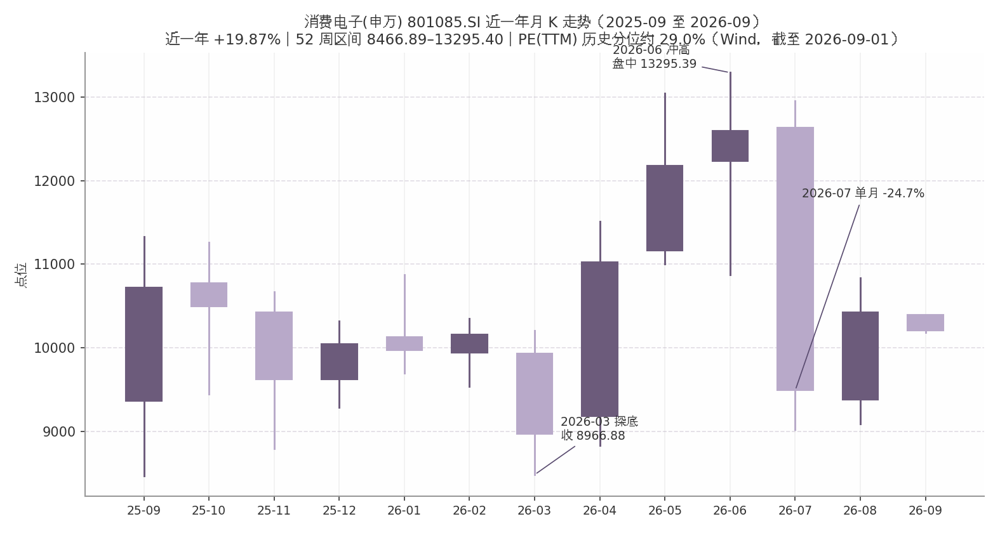

## 第四章 A 股消费电子板块：行情与估值

### 4.1 板块行情：近一年 +19.87%，2026 年 V 形震荡

截至 2026 年 9 月 1 日，消费电子(申万)指数（801085.SI）收报 10209.64 点，近一年（250 个交易日）累计上涨 19.87%，但年初至今涨幅仅 1.64%，当日下跌 2.07%（Wind，截至 2026-09-01）。"年度正收益、年内近零"的组合背后，是 2026 年以来板块罕见的大幅双向波动：52 周高点 13295.40 点与低点 8466.89 点之间的最大振幅达 57.0%（Wind，截至 2026-09-01）。

月 K 数据呈现三段式"V 形—冲高—急跌"轨迹。第一段为缩量下行：自 2025 年 9 月收盘 10720.35 点起步，板块连月走弱，2026 年 3 月收报 8966.88 点（盘中最低 8481.03 点），区间累计下跌 16.4%（Wind 月 K，截至 2026-09-01）。第二段为放量主升：2026 年 4—6 月连续三根长阳，6 月收报 12598.57 点（盘中最高 13295.39 点），三个月反弹 40.5%；月成交额由 2 月的 8596 亿元放大至 6 月的 2.61 万亿元，放量逾两倍（Wind 月 K，截至 2026-09-01），对应苹果链备货上修与 AI 终端预期发酵。第三段为急跌修复：7 月单月暴跌 24.7%，收报 9489.20 点，几乎抹平二季度全部涨幅，主要背景是存储芯片涨价对终端 BOM 成本的冲击与全年出货预测的连续下修（IDC 估算 2026Q2 内存成本同比上涨近 300%，2026-07-14 发布）；8 月板块反弹 9.9% 收报 10425.23 点；9 月 1 日板块再度回调 2.07%，修复节奏仍有反复（Wind 月 K，截至 2026-09-01）。

### 4.2 估值水平与申万电子对照

估值层面最核心的事实是"绝对估值不低、历史分位偏低、相对电子大板块深度折价"。行情快照口径下，消费电子(申万)市盈率（TTM）38.18 倍、市净率 4.57 倍；Wind 基本面口径下 PE(TTM) 为 34.4 倍、PB 4.47 倍，最新 PE 处于 6244 个交易日历史样本的约 29.0% 分位（Wind，截至 2026-09-01；两工具聚合口径不同，并列列示，未强行统一）。

| 指标 | 消费电子(申万) 801085.SI | 电子(申万) 801080.SI |
|---|---|---|
| 收盘点位 | 10209.64 | 8692.78 |
| 年初至今涨跌幅 | +1.64% | +32.63% |
| 近一年（250 日）涨跌幅 | +19.87% | +56.87% |
| 市盈率（TTM） | 38.18 倍（快照）/ 34.4 倍（基本面） | 82.19 倍 |
| 市净率 | 4.57 倍 / 4.47 倍 | 6.48 倍 |
| PE 历史分位 | 约 29.0%（6244 个交易日样本） | 未获取 |

（数据来源：Wind，截至 2026-09-01）

对照表揭示的是一轮典型的结构性定价分化。消费电子相对电子大板块的 PE 折价约 53%–58%，近一年收益落后约 37 个百分点，差距主要源于资金按"AI 算力链—终端消费链"两条线重新定价：电子大板块内的半导体与算力硬件受 AI 服务器需求驱动景气上行，而消费电子子板块直接承受终端出货疲软与存储涨价对毛利率的双向挤压，估值扩张缺乏业绩支撑。需要指出的是，约 29.0% 的历史 PE 分位意味着当前定价已隐含相当程度的悲观出货预期，板块估值安全边际有所改善，但"低分位"本身不构成买入理由——若 2027 年存储成本压力缓解、国补与 AI 手机换机周期兑现，板块具备估值修复弹性；反之，若终端涨价对需求的压制超预期，盈利下修可能令静态低分位失效，估值与盈利的匹配度仍需以出货数据逐季验证。
